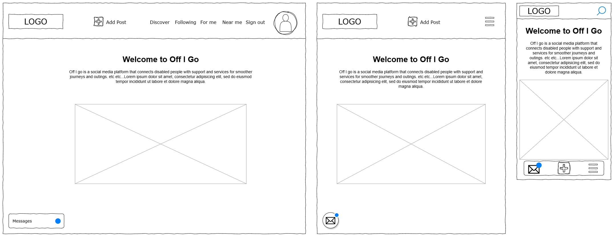
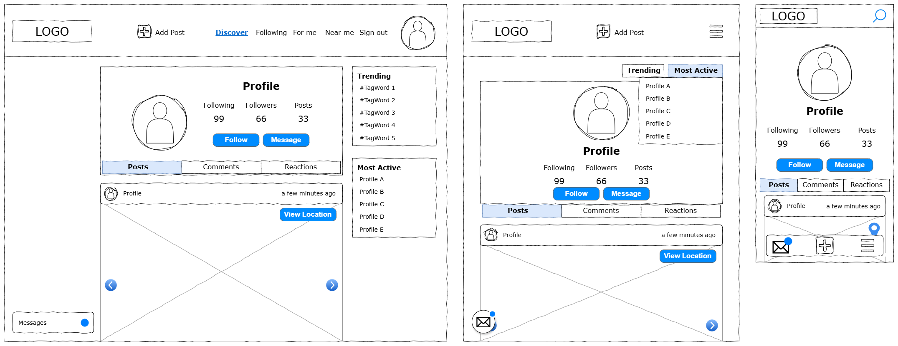
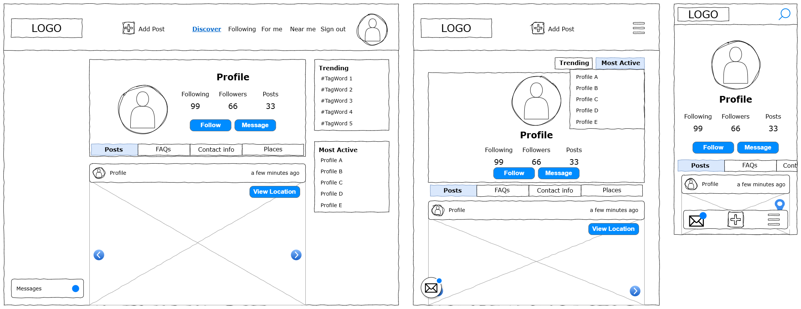
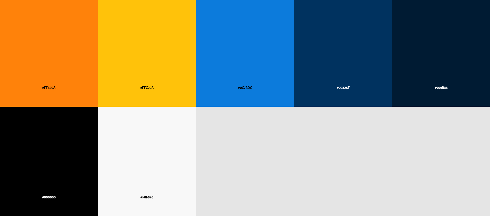
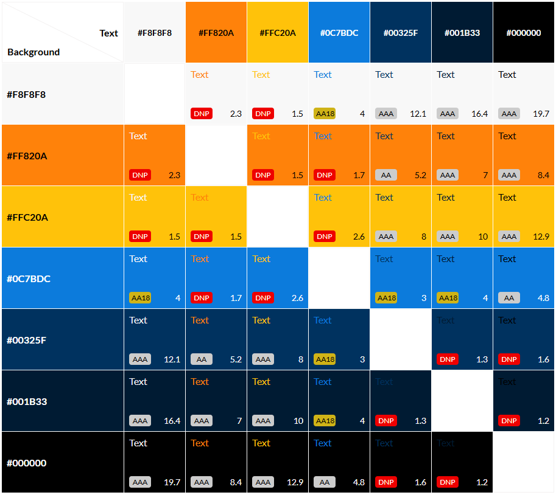
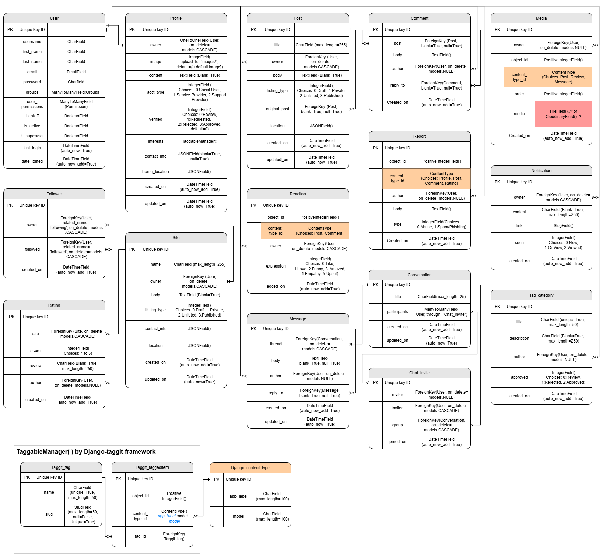

# Off I go
**The journey planning platform for peopled with a condition or impairment**

As my fifth and last Portfolio project with Code Institute, I built this content sharing platform with Django REST Framework and React.

**Off I go** is made with disabled people in mind, to share advice with each other, connect them with Service Providers and Support Providers to find information on accessible features of a given site/service as the user plans their journey. 
Service Providers can register, share what facilities they have to support visitors and provide contact details.
Support Providers can register, share the latest information on rights and supporting schemes available, as well as advice such as on staying healthy or gaining further independence.
Social Users can register, share their wins and obstacles, learn of sites they may wish to visit on a journey or commute and reach out to Providers.

<!-- View the deployed site [here.]() 

 -->

***

# Table of contents
<!-- * [Front-End](#front-end-docs) -->

***

# Front-End docs
## User Experience design
<!-- UX design - wireframes, mock-ups and design diagrams -->
### **Strategy**
<!-- What are you hoping to achieve and for whom? -->
The intention of this project is to promote more inclusivity with businesses that are not catering to the needs of disabled people and to offer a more convenient tool to educate all parties and facilitate more interaction with our users.

#### **Target Audience**
There are three distinct target users in this project will cater for.

1) **Social Users** - Namely, disabled people and people with a condition or impairment, or caregivers that use our platform to plan their journey. 
    - Social users are looking for ideas for fun days out or to plan as smooth a journey/commute as possible.
    - Social users want information that is most relevant to their needs, interests and location.
    - Social users want to have the means to communicate their satisfactions or frustrations in a forum that is best able to empathise.

2) **Service Providers** - Verified official users that can provide information of their sites and services, to encourage more of our social users to use these services.
    - Service providers want to reach our social users on a platform that is focused on meeting their needs to share what the provider can offer.
    - Service providers want to share the best means for users to contact the provider to make enquiries or request assistance.
    - Service providers want to receive feedback from our users to improve the service they provide.
    - Example of service providers:
      - [TfL (Transport for London)](https://tfl.gov.uk/) - could create and update posts for a given station, detailing accessible entries/exits, available ramps and toilets or how to get assistance.
      - A restaurant or franchise - could create and update posts regarding their restaurant accessible features.

3) **Support Providers** - Verified official users that can provide information on support and advice they offer.
    - Support providers want to reach both social users and service providers to foster an environment of empathy and inclusivity.
    - Support providers want to help service providers improve their services in simple but effective ways, be it site facilities or how their staff treat our social users.
    - Support providers want to help the social users find ways to a better quality of life, with advice on travelling for work or leisure, rights and how to manage common obstacles.
    - Examples of support providers:
      - [Scope for business](https://business.scope.org.uk/) - could create and update posts for their articles advising on items such as inclusive language in the workplace, digital accessibility, rights to transport.
      - [CILNI](https://cilni.org/) - Similarly, create and update posts for their articles and services to promote inclusivity and remove physical and social barriers.

#### **Site Goals**
- Build a platform dedicated for disabled people that want to enjoy journeys or outings with a greater sense of independence.
- Open a line of communication between local businesses and their potential clientele to raise awareness and help make accommodations.
  - Businesses can educate themselves and partner up with Support providers to improve their facilities and have a platform they can share their updates.
  - Customers can more easily find venues to visit on their next trip they will enjoy.
- Maximise interaction, by allowing users to create content that their audience can react to, comment on, share and bookmark.
- Further features such as map location pins and integration of Google maps would make the platform the go to for easier journey planning with accessibility requirements.
- Design it for mobile first, it is a crucial element for being out and about. 

### **Scope**
<!-- Which features based on your strategy plane do you want to include in your design? What's on for production release and what's not, for now? -->
Give the most value to our users by prioritising our Must have features to develop our MVP, before adding additional desirable features.

#### **Must have features: **
  - Users intuitively navigate the site with minimum learning and clicking/tapping effort needed.
  - Users can sign up, differentiating social users from Service or Support providers as this must require some form of verification.
  - Logged in users can populate their profile and edit later so others can learn more about them.
  - Logged in users can view all published posts, like and comment.
  - Logged in users can create a post adding photos or videos or map location or tags, as well as edit and delete.
  - Users view most recent posts first, so they have the latest information.
  - Users can configure the posts they see by filtering by profiles they follow, topics of interest or location.

#### **Should have features: **
  - Users can share a link to a post to raise awareness outside of the platform.
  - On registration, users can provide information on their interests and needs, so users can see the benefit of the site soon after signing up.
  - Service and Support provider users can add contact details for general enquiries, booking assistance and perhaps be location specific to make it easier for users to contact the most relevant department.
  - Users can lookup locations provided on posts, profiles, comments to best aid them in journey planning on their chosen Online map resource.

#### **Could have features: **
  - Users can repost another user's post to raise more awareness.
  - Trending tags, most recently used tags, so users can follow a particular highlight.
  - Most recently active Profiles, so users can easily have a look at profiles that are most engaging, frequently posting up-to-date content. 
  - Users can express another reaction other than like.
  - Users can direct message other users to discuss more specific information.
  - Users can receive notifications of updates, such as new comments on a post, likes and follows.

#### **Won't have features: **
  - Users can plan their next journey completely within the site, powered by a mapping service, likely Google Maps, where the site can break down the journey segments and recommend more accessible entries/exits, contacts for booking assistance at the given site and highlight what other users may have said in the past.
  - Service providers can use the site's built in booking feature to book assistance requests, where social users can make a request and the provider can Approve, suggest adjustments or reject suspected spam requests.

### Structure
<!-- How is the information structured and how is it logically grouped? -->
<!-- Describe how a user might navigate the page -->
A reactive single page site powered by React and Django to provide the API. The page will not require refreshing between navigation of pages as it'll render the components and content, based on the user interactions. A consistent layout will be maintained to make navigation predictable, this will be done with:

Header/Nav Bar always available, either along the header or in a collapsed menu and will contain the following links:
  - Logo or "Discover" - will display a feed of the latest posts without any filtering done, this will be the preset homepage.
  - **If logged out**:
    - "Sign in" - to present to the log in form.
    - "Sign up" - to present the registration form, forwards user to sign in on submission.
  - **If logged in**:
    - "Discover" - to display a feed of all the latest posts published
    - "Feed" - to display a feed of the latest posts filtered by profiles the user is following.
    - "For me" - to display a feed of the latest posts filtered by tags the user is interested in.
    - "Near me" - to display a feed of the latest posts filtered by a user's set location or current location.
    - "Sign out" - to logout.
    - "Profile" (Avatar) - for User to view own profile.

In the main body, the content is displayed, and it varies with each view:
  - **About**, a short block above the Feed of posts in the homepage/"Discover" page, which appears if no user is logged in, briefly explaining the intent of site and how to use it.
  - **Feeds of posts**, will present itself as a scrolling string of posts. In this view, posts will display, the author profile Avatar and name, time posted, Media content, title, content, a count of likes/reactions, a count of comments and button to share the URL to the post. Clicking on:
    - Author Avatar - presents the author’s profile.
    - Media or comment icon - renders the single post alone with the thread of comments.
    - Like button - Adds/removes a like from the viewing user, if it's a reactions button, it will open a dropdown menu to select reaction.
  - **Profile** - User can see the Avatar, username, bio, statistics of followers/following, a feed of posts this profile has authored and a map view showing the locations tagged across comments. 
  - **Own profile** - same as above, but user can make changes to avatar, bio and login details. The user can see a separate feed of posts they have authored but still as a draft or set private, as well as posts they have reacted to or commented on.

### Skeleton
<!-- How will our information be represented and how will the user navigate the information and features? -->
<!-- include wireframes or mock-ups -->
#### Wireframes

    
<strong>Welcome page</strong>

    

    
<strong>Feed</strong>

    

    
<strong>Feed - Menus expanded</strong>

    
    

    
<strong>Profile page - Social User</strong>

    

    
<strong>Profile page - Service/Support Provider</strong>

    
    

### Surface
<!-- What will the finished product look like? Colours, typography and design elements will we use? -->
#### Colour theme
For a modern and fun apparel and still compatible for colour blindness a palette was built off pairing of a bright blue and a deep yellow. This is a pair that has is often documented as offering good contrast for colourblind users. Auxiliary colours include a bright orange, 2 other shades darker of the blue and white and black. The yellow is used as the background highlighting colour whilst the blues are used for interaction points, orange for some highlighted text. The combination was intended to feel exciting, fun and friendly, perhaps inspiring the joy of being out in sunny weather.

    
<strong>Contrast grip</strong>

    
Used contrast grid to verify which colours offers best contrast for legibility. There's a distinct and virtually symmetrical relation in this chart, with great choice of legible combinations in either bottom left and top right corners.
    <a href="https://contrast-grid.eightshapes.com/?version=1.1.0&background-colors=&foreground-colors=%23f8f8f8%0D%0A%23ff820a%0D%0A%23ffc20a%0D%0A%230c7bdc%0D%0A%2300325f%0D%0A%23001b33%0D%0A%23000000&es-color-form__tile-size=regular&es-color-form__show-contrast=aaa&es-color-form__show-contrast=aa&es-color-form__show-contrast=aa18&es-color-form__show-contrast=dnp" target="blank">Click here to view the contrast grid directly.</a>

    

    
<strong>Adobe Colour Blindness simulator</strong>

    
Used Adobe Colour blindness simulator, this tool verifies these colours are perceived with enough contrast against common forms of colour-blindness. They seem safe for all viewing.
    <a href="https://color.adobe.com/create/color-accessibility" target="blank">Link to the adobe tool used.</a>

    

<!-- Security practices -->
<!-- Explanation of measures implemented in front-end, like handling secret keys -->

<!-- Component Usage -->
<!-- Details on the use of React components, inc Architecture and component composition -->

<!-- Deployment Process -->
<!-- Step-by-step guide on how to deploy the Front-end application -->

# Back-End docs
API review
<!-- A description of the API, including its functionality and how it integrates with the Front-End -->

Database design
<!-- Structure of the database, including custom models used -->

<!-- Security Measures -->
<!-- Details on security practices in the back-end, including handling of sensitive data -->

<!-- Deployment Process -->
<!-- Instructions for deploying the Back-end application -->

# Code Standards and Practices
<!-- Front-end Code standards -->
<!-- Info on coding standards followed, e.g. JSX coding practices, modular component use -->

<!-- Back-end Code standards -->
<!-- Python coding standards followed, adhering to PEP8 guidelines -->

# Testing and version Control
<!-- Manual testing -->
<!-- Documentation of manual testing procedures and results for both front end and back end -->

<!-- Version control -->
<!-- Usage of git and GitHub for version control, inc an explanation of commit message conventions and branch mgmt. -->

# Known bugs
- **FIXED - dropdown menu on widget** - in trying to use a dropdown button from react-bootstrap, cannot seem to configure the visibility of the *::after* feature of the button so we do not get the little arrow displayed. It is not major, but it is visually unnecessary and there will be another way of doing this, probably using a regular bootstrap button that toggles the visibility of the menu, just hopefully we can still configure the menu to display upwards. 
 - Fix was simple, I was able to use React-Bootstrap's basic NavBar and rearrange the NavBar.Toggle element so it is below the NavBar.Collapse element, that way it expands the menu above it. Once I figured that out, it was pretty simple to configure the stylings. Also, found a [link to a fix on Stack Overflow](https://stackoverflow.com/a/61134859) for using your own icon or text rather than bootstrap's generic icon that is hard to configure the style of.

- **NavBar links on a medium width display** - as the user is logged in, the navbar gets too cluttered on a medium width if the links include both icon and text, so I moved the text to spans that are hidden at the medium width using 'd-md-none', but I had wanted to make the text appear only if the parent element, the Nav.Link was active. So I used the useState to update a const 'pathname' to compare to the link's pathname and remove the 'd-md-none' from the className group should it match. This works to some extent, except if the user clicks on a link that does not set the constant. There should be a way of doing this with a custom Hook, however this is a minor issue and I can always fallback to a collapse navbar rather than displaying the icons.

- **Django-taggit and TaggitSerializer no accepting blank fields** - testing creating Posts after implementing django taggit, it seems no matter if we pass _required=False_ in the taggitSerializer or not, it still throws an error specifying it cannot be blank. This is a commonly raised [issue](https://github.com/jazzband/django-taggit/issues/127) and I have not found a viable solution for it yet. For now, I may have to setup a default tag of 'none', so should a Post be created, the react app will set the tag as 'none' in the absence of any others.

# Agile Project Management
## User Stories
<!-- List of all user stories and how they map to the project goals -->

### EPIC: Navigation

| User Story | Priority | Link |
|------------|----------|------|
| As a **user** I can **see the nav bar from every page**, so that **I can easily navigate the site and find the various feeds and info**. | MUST have | [#1](https://github.com/dasic002/off-i-go/issues/1) |
| As a **user** I can **easily find the navigation links on any size display**, so that **it is still easy to navigate the site**. | MUST have | [#2](https://github.com/dasic002/off-i-go/issues/2) |
| As a **user** I can **quickly navigate the website**, so that **content is displayed effortlessly**. | MUST have | [#3](https://github.com/dasic002/off-i-go/issues/3) |
| As a **user** I can **see other profiles' Avatar and username**, so that **can easily identify and view their profile page**. | MUST have | [#10](https://github.com/dasic002/off-i-go/issues/10) |
| As a **logged out user** I can **see sign in/sign up links on the nav bar**, so that **I can sign back in or sign up**. | MUST have | [#11](https://github.com/dasic002/off-i-go/issues/11) |

### EPIC: Authentication

| User Story | Priority | Link |
|------------|----------|------|
| As a **user** I can **sign up**, so that **I can access all the features available**. | MUST have | [#5](https://github.com/dasic002/off-i-go/issues/5) |
| As a **user** I can **sign in with my account details**, so that **I can use the functionalities available to me**. | MUST have | [#6](https://github.com/dasic002/off-i-go/issues/6) |
| As a **user** I can **see whether I'm logged in or not**, so that **I can log in if needed**. | MUST have | [#7](https://github.com/dasic002/off-i-go/issues/7) |
| As a **user** I can **remain logged in**, so that **I can log out when I choose to and not have a frustrating experience of the website**. | MUST have | [#8](https://github.com/dasic002/off-i-go/issues/8) |
| As a **user**, I can **enter a username on signup and get immediate feedback if the name is available**, so that **I can reduce the number of attempts at registering**. | COULD have | [#38](https://github.com/dasic002/off-i-go/issues/38) |
| As a **logged in user**, I can **update my username and password and have my browser detect the change**, so that **I do not have to remember it on logging back in next time**. | COULD have | [#39](https://github.com/dasic002/off-i-go/issues/39) |
| As a **user**, I can **select whether I want to remain logged in for 24hrs**, so that **my account is not as easily compromised when sharing a device**. | COULD have | [#40](https://github.com/dasic002/off-i-go/issues/40) |

### EPIC: Basics of posts

| User Story | Priority | Link |
|------------|----------|------|
| As a **logged in user** I can **create posts**, so that **I can share my thoughts of accessible facilities or services of a given site**. | MUST have | [#12](https://github.com/dasic002/off-i-go/issues/12) |
| As a **user** I can **view the details of a single post**, so that **I can learn more about it**. | MUST have | [#13](https://github.com/dasic002/off-i-go/issues/13) |
| As a **logged in user** I can **like a post**, so that **I can show my support for the posts that interest me**. | MUST have | [#14](https://github.com/dasic002/off-i-go/issues/14) |

### EPIC: Feeds View

| User Story | Priority | Link |
|------------|----------|------|
| As a **user** I can **view most recent posts first**, so that **I am up-to-date**. | MUST have | [#16](https://github.com/dasic002/off-i-go/issues/16) |
| As a **user** I can **search for posts with a keyword**, so that **find content that interests me**. | MUST have | [#17](https://github.com/dasic002/off-i-go/issues/17) |
| As a **logged in user** I can **view my posts I have liked before**, so that **I can find posts that I enjoyed**. | MUST have | [#18](https://github.com/dasic002/off-i-go/issues/18) |
| As a **logged in user** I can **view all the posts from profiles I follow**, so that **I can stay updated on posts from the sources I enjoy the most**. | MUST have | [#19](https://github.com/dasic002/off-i-go/issues/19) |
| As a **user** I can **keep scrolling through the posts and more are loaded for me automatically** so that **I don't have to click on "next page"**. | MUST have | [#20](https://github.com/dasic002/off-i-go/issues/20) |

### EPIC: Post detail view

| User Story | Priority | Link |
|------------|----------|------|
| As a **user** I can **view the post's page** so that **I can read the comments about the post**. | MUST have | [#21](https://github.com/dasic002/off-i-go/issues/21) |
| As a **post owner** I can **edit my post title and description** so that **I can make corrections or update my post after it was created**. | MUST have | [#22](https://github.com/dasic002/off-i-go/issues/22) |
| As a **logged in user** I can **add comments to a post** so that **I can share my thoughts about the post**. | MUST have | [#23](https://github.com/dasic002/off-i-go/issues/23) |
| As a **user** I can **see how long ago a comment was made** so that **I know how old a comment is**. | MUST have | [#24](https://github.com/dasic002/off-i-go/issues/24) |
| As a **user** I can **read comments on posts** so that **I can read what other users think about the posts**. | MUST have | [#25](https://github.com/dasic002/off-i-go/issues/25) |
| As an **owner of a comment** I can **delete my comment** so that **I can control removal of my comment from the application**. | MUST have | [#26](https://github.com/dasic002/off-i-go/issues/26) |
| As an **owner of a comment** I can **edit my comment** so that **I can fix or update my existing comment**. | MUST have | [#27](https://github.com/dasic002/off-i-go/issues/27) |

### EPIC: Profile CRUD

| User Story | Priority | Link |
|------------|----------|------|
| As a **user** I can **view other users profiles** so that **I can see their posts and learn more about them**. | MUST have | [#28](https://github.com/dasic002/off-i-go/issues/28) |
| As a **user** I can **see a list of the recently most active profiles** so that **I can discover new profiles that may interest me**. | SHOULD have | [#29](https://github.com/dasic002/off-i-go/issues/29) |
| As a **user** I can **view statistics about a specific user: bio, number of posts, follows and users followed** so that **I can learn more about them**. | MUST have | [#30](https://github.com/dasic002/off-i-go/issues/30) |
| As a **social user** I can **view statistics about a specific Service provider user: ratings on the platform, certification and verification** so that **I can gauge the commitment to providing accessibility**. | COULD have | [#31](https://github.com/dasic002/off-i-go/issues/31) |
| As a **logged in user** I can **follow and unfollow other users** so that **I can see and remove posts by specific users in my posts feed**. | MUST have | [#32](https://github.com/dasic002/off-i-go/issues/32) |
| As a **user** I can **view all the posts by a specific user** so that **I can catch up on their latest posts, or decide I want to follow them**. | MUST have | [#33](https://github.com/dasic002/off-i-go/issues/33) |
| As a **logged in user** I can **edit my profile**, so that **I can change my profile picture and bio**. | MUST have | [#34](https://github.com/dasic002/off-i-go/issues/34) |
| As a **logged in user** I can **update my username and password**, so that **I can change my display name and keep my profile secure**. | MUST have | [#35](https://github.com/dasic002/off-i-go/issues/35) |
| As a **user**, I can **select subjects and/or locations that interest me on signing up**, so that **I can see a feed of posts tailored to my interests and needs**. | SHOULD have | [#37](https://github.com/dasic002/off-i-go/issues/37) |

### EPIC: Further Post interactions

| User Story | Priority | Link |
|------------|----------|------|
| As a **logged in user**, I can **have another reaction rather than like on a post**, so that **I can share my feelings on a post in just a couple of clicks**. | SHOULD have | [#41](https://github.com/dasic002/off-i-go/issues/41) |
| As a **user**, I can **easily share a link to a post with others**, so that **I can make them aware of this piece of information**. | SHOULD have | [#42](https://github.com/dasic002/off-i-go/issues/42) |
| As a **logged in user**, I can **generate a post myself to share another user’s post**, so that **I can make my followers aware of this piece of information**. | COULD have | [#43](https://github.com/dasic002/off-i-go/issues/43) |
| As a **logged in user**, I can **view the posts I have commented on**, so that **I can follow-up of further responses**. | COULD have | [#44](https://github.com/dasic002/off-i-go/issues/44) |

### EPIC: Contact details

| User Story | Priority | Link |
|------------|----------|------|
| As a **social user**, I can **book for assistance within my route planner**, so that **I don’t have to look for contact details still and repeat all the same information supplied in my route planner**. | WON'T have | [#52](https://github.com/dasic002/off-i-go/issues/52) |
| As a **service provider**, I can **add contact information**, so that **a user can easily find the best means to book assistance or find out more information**. | SHOULD have | [#53](https://github.com/dasic002/off-i-go/issues/53) |
| As a **Service Provider**, I can **add sites to my profile**, so that **posts specific to location can be tagged and specific contact details can be linked to the post**. | SHOULD have | [#54](https://github.com/dasic002/off-i-go/issues/54) |

### EPIC: Map integration

| User Story | Priority | Link |
|------------|----------|------|
| As a **user**, I can **filter posts by location**, so that **I can find content relevant to my neighbourhood or journey**. | SHOULD have | [#36](https://github.com/dasic002/off-i-go/issues/36) |
| As a **post owner**, I can **add a location on a map to my post**, so that **other users know where they may find the features/services mentioned in the post**. | MUST have | [#45](https://github.com/dasic002/off-i-go/issues/45) |
| As a **user**, I can **subscribe to saved location lists published by “Off I go”**, so that **I can see them in my next route planning**. | SHOULD have | [#46](https://github.com/dasic002/off-i-go/issues/46) |
| As a **Google Maps user**, I can **toggle visibility of lists depending on my needs**, so that **I can see pins relevant to my journey**. | SHOULD have | [#47](https://github.com/dasic002/off-i-go/issues/47) |
| As a **social user**, I can **plan my route within an integrated map on the site**, so that **I can benefit from the accessibility considerations on this site**. | WON'T have | [#51](https://github.com/dasic002/off-i-go/issues/51) |

<!-- Agile Practices -->
<!-- Explanation of Agile methodologies used, such as sprint planning and tracking with GitHub projects -->

# Additional Information
<!-- Frontend Libraries -->
<!-- Justifications for the choice of specific front-end libraries used in the project -->

## Credits
<!-- List of tutorials or articles used while developing the project -->
### Code
- [Django Docs](https://docs.djangoproject.com/en/3.2/) frequently referred to throughout the development of this project.
- Tutorial from Code Institute's Moments walkthrough project was referred to often to remind me how we implemented a feature and why.
- [Django taggit docs](https://django-taggit.readthedocs.io/en/latest/getting_started.html) referred to for implementation steps and a YouTube video by [BugBytes](https://youtu.be/iFE6nhst2r8?si=-P1Cp_u20TwoLs10) helped me understand the structure of the taggit models.
- [Timmy O'Mahony Blog's](https://timmyomahony.com/blog/the-missing-gfk-model-manager-for-django-models/) article helped me understand what GFK was and how it could be used.
- [Generic Relations](https://docs.djangoproject.com/en/3.2/ref/contrib/contenttypes/#generic-relations) helped me build models that needed to become more generic across the models.
- [PawfectMatch project](https://github.com/Julia-Wagner/PawfectMatch-API/blob/main/medias/models.py) taught me about the simple implementation of CloudinaryVideoStorage to be able to upload videos without a lot more prep work like finding another library or implementing Cloudinary's Python SDK.
- Copilot AI within GitHub was used to help generate the basis of Acceptance Criteria and Tasks of our User Stories issues.

### Content
Advice for promoting inclusivity for disabled people and people with impairments referred to, from sites such as [Scope](https://www.scope.org.uk/advice-and-support/finding-accessible-transport), various articles at [Scope for business](https://business.scope.org.uk/), [nidirect](https://www.nidirect.gov.uk/articles/planning-trip-if-you-have-disability) and [CILNI](https://cilni.org/travel-with-ease-essential-tips-for-travelers-with-disabilities/).

### Media
- [Vector images of disabled characters](https://www.freevector.com/set-of-empowering-disabled-people-character-57686#) used in Sign up and Sign in Forms.
<!-- License -->
<!-- Information about the software license (if applicable) -->

