# Off I go

**The journey planning platform for people with a condition or impairment**

As my fifth and last Portfolio project with Code Institute, I built this content sharing platform with Django REST Framework and React.

**Off I go** is made with disabled people in mind, to share advice with each other, connect them with Service Providers and Support Providers to find information on accessible features of a given site/service as the user plans their journey.
Service Providers can register, share what facilities they have to support visitors and provide contact details.
Support Providers can register, share the latest information on rights and supporting schemes available, as well as advice such as on staying healthy or gaining further independence.
Social Users can register, share their wins and obstacles, learn of sites they may wish to visit on a journey or commute and reach out to Providers.

View the deployed site [here.](https://off-i-go-2-0-06c5c4d209c5.herokuapp.com/)<br>

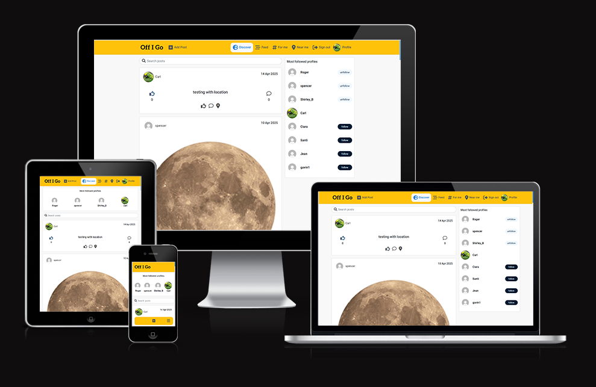

---

# Table of contents

- [Front-End](#front-end-documentation)
  - [User Experience design](#user-experience-design)
  - [Technologies](#technologies)
  - [Security practices](#security-practices)
  - [Deployment Process](#deployment-process)
- [Back-End](#back-end-documentation)
  - [API Overview](#api-overview)
  - [Database design](#database-design)
  - [Security Measures](#security-measures)
  - [Setup and Deployment Process](#setup-and-deployment-process)
- [Code Standards and Practices](#code-standards-and-practices)
- [Testing and version control](#testing-and-version-control)
  - [Known bugs](#known-bugs)
- [Agile Project Management](#agile-project-management)
  - [User Stories](#user-stories)
  - [Agile Practices](#agile-practices)
- [Additional Information](#additional-information)
  - [Credits](#credits)

---

# Front-End documentation

## User Experience design

<!-- UX design - wireframes, mock-ups and design diagrams -->

### **Strategy**

<!-- What are you hoping to achieve and for whom? -->

The intention of this project is to promote more inclusivity with businesses that are not catering to the needs of disabled people and to offer a more convenient tool to educate all parties and facilitate more interaction with our users.

#### **Target Audience**

There are three distinct target users in this project will cater for.

1. **Social Users** - Namely, disabled people and people with a condition or impairment, or caregivers that use our platform to plan their journey.

   - Social users are looking for ideas for fun days out or to plan as smooth a journey/commute as possible.
   - Social users want information that is most relevant to their needs, interests and location.
   - Social users want to have the means to communicate their satisfactions or frustrations in a forum that is best able to empathise.

2. **Service Providers** - Verified official users that can provide information of their sites and services, to encourage more of our social users to use these services.

   - Service providers want to reach our social users on a platform that is focused on meeting their needs to share what the provider can offer.
   - Service providers want to share the best means for users to contact the provider to make enquiries or request assistance.
   - Service providers want to receive feedback from our users to improve the service they provide.
   - Example of service providers:
     - [TfL (Transport for London)](https://tfl.gov.uk/) - could create and update posts for a given station, detailing accessible entries/exits, available ramps and toilets or how to get assistance.
     - A restaurant or franchise - could create and update posts regarding their restaurant accessible features.

3. **Support Providers** - Verified official users that can provide information on support and advice they offer.
   - Support providers want to reach both social users and service providers to foster an environment of empathy and inclusivity.
   - Support providers want to help service providers improve their services in simple but effective ways, be it site facilities or how their staff treat our social users.
   - Support providers want to help the social users find ways to a better quality of life, with advice on travelling for work or leisure, rights and how to manage common obstacles.
   - Examples of support providers:
     - [Scope for business](https://business.scope.org.uk/) - could create and update posts for their articles advising on items such as inclusive language in the workplace, digital accessibility, rights to transport.
     - [CILNI](https://cilni.org/) - Similarly, create and update posts for their articles and services to promote inclusivity and remove physical and social barriers.

#### **Site Goals**

- Build a platform dedicated for disabled people that want to enjoy journeys or outings with a greater sense of independence.
- Open a line of communication between local businesses and their potential clientele to raise awareness and help make accommodations.
  - Businesses can educate themselves and partner up with Support providers to improve their facilities and have a platform they can share their updates.
  - Customers can more easily find venues to visit on their next trip they will enjoy.
- Maximise interaction, by allowing users to create content that their audience can react to, comment on, share and bookmark.
- Further features such as map location pins and integration of Google maps would make the platform the go to for easier journey planning with accessibility requirements.
- Design it for mobile first, it is a crucial element for being out and about.

### **Scope**

<!-- Which features based on your strategy plane do you want to include in your design? What's on for production release and what's not, for now? -->

Give the most value to our users by prioritising our Must have features to develop our MVP, before adding additional desirable features.

#### Must have features:

- Users intuitively navigate the site with minimum learning and clicking/tapping effort needed.
- Users can sign up, differentiating social users from Service or Support providers as this must require some form of verification.
- Logged in users can populate their profile and edit later so others can learn more about them.
- Logged in users can view all published posts, like and comment.
- Logged in users can create a post adding photos or videos or map location or tags, as well as edit and delete.
- Users view most recent posts first, so they have the latest information.
- Users can configure the posts they see by filtering by profiles they follow, topics of interest or location.

#### Should have features:

- Users can share a link to a post to raise awareness outside of the platform.
- On registration, users can provide information on their interests and needs, so users can see the benefit of the site soon after signing up.
- Service and Support provider users can add contact details for general enquiries, booking assistance and perhaps be location specific to make it easier for users to contact the most relevant department.
- Users can lookup locations provided on posts, profiles, comments to best aid them in journey planning on their chosen Online map resource.

#### Could have features:

- Users can repost another user's post to raise more awareness.
- Trending tags, most recently used tags, so users can follow a particular highlight.
- Most recently active Profiles, so users can easily have a look at profiles that are most engaging, frequently posting up-to-date content.
- Users can express another reaction other than like.
- Users can direct message other users to discuss more specific information.
- Users can receive notifications of updates, such as new comments on a post, likes and follows.

#### Won't have features:

- Users can plan their next journey completely within the site, powered by a mapping service, likely Google Maps, where the site can break down the journey segments and recommend more accessible entries/exits, contacts for booking assistance at the given site and highlight what other users may have said in the past.
- Service providers can use the site's built in booking feature to book assistance requests, where social users can make a request and the provider can Approve, suggest adjustments or reject suspected spam requests.

### Structure

<!-- How is the information structured and how is it logically grouped? -->
<!-- Describe how a user might navigate the page -->

A reactive single page site powered by React and Django to provide the API. The page will not require refreshing between navigation of pages as it'll render the components and content, based on the user interactions. A consistent layout will be maintained to make navigation predictable, this will be done with:

Header/Nav Bar always available, either along the header or in a collapsed menu and will contain the following links:

- Logo or "Discover" - will display a feed of the latest posts without any filtering done, this will be the preset homepage.
- **If logged out**:
  - "Sign in" - to present to the log in form.
  - "Sign up" - to present the registration form, forwards user to sign in on submission.
- **If logged in**:
  - "Discover" - to display a feed of all the latest posts published
  - "Feed" - to display a feed of the latest posts filtered by profiles the user is following.
  - "For me" - to display a feed of the latest posts filtered by tags the user is interested in.
  - "Near me" - to display a feed of the latest posts filtered by a user's set location or current location.
  - "Sign out" - to logout.
  - "Profile" (Avatar) - for User to view own profile.

In the main body, the content is displayed, and it varies with each view:

- **About**, a short block above the Feed of posts in the homepage/"Discover" page, which appears if no user is logged in, briefly explaining the intent of site and how to use it.
- **Feeds of posts**, will present itself as a scrolling string of posts. In this view, posts will display, the author profile Avatar and name, time posted, Media content, title, content, a count of likes/reactions, a count of comments and button to share the URL to the post. Clicking on:
  - Author Avatar - presents the author’s profile.
  - Media or comment icon - renders the single post alone with the thread of comments.
  - Like button - Adds/removes a like from the viewing user, if it's a reactions button, it will open a dropdown menu to select reaction.
- **Profile** - User can see the Avatar, username, bio, statistics of followers/following, a feed of posts this profile has authored and a map view showing the locations tagged across comments.
- **Own profile** - same as above, but user can make changes to avatar, bio and login details. The user can see a separate feed of posts they have authored but still as a draft or set private, as well as posts they have reacted to or commented on.

### Skeleton

<!-- How will our information be represented and how will the user navigate the information and features? -->
<!-- include wireframes or mock-ups -->

#### Wireframes

<details>
    <summary><strong>Welcome page</strong></summary>
    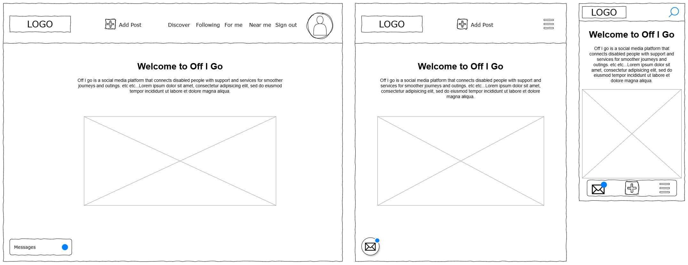
</details>

<details>
    <summary><strong>Feed</strong></summary>
    
</details>

<details>
    <summary><strong>Feed - Menus expanded</strong></summary>
    
    
</details>

<details>
    <summary><strong>Profile page - Social User</strong></summary>
    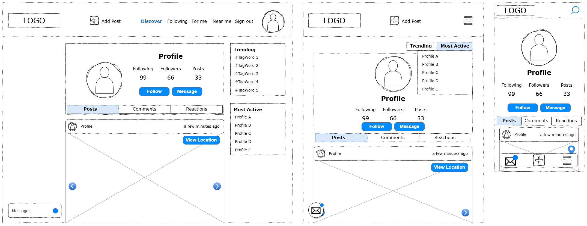
</details>

<details>
    <summary><strong>Profile page - Service/Support Provider</strong></summary>
    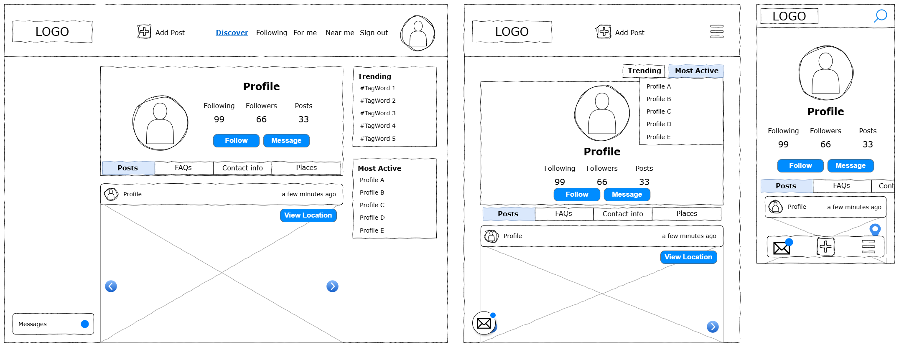
    
</details>

### Surface

<!-- What will the finished product look like? Colours, typography and design elements will we use? -->

#### Colour theme

For a modern and fun apparel and still compatible for colour blindness a palette was built off pairing of a bright blue and a deep yellow. This is a pair that has is often documented as offering good contrast for colourblind users. Auxiliary colours include a bright orange, 2 other shades darker of the blue and white and black. The yellow is used as the background highlighting colour whilst the blues are used for interaction points, orange for some highlighted text. The combination was intended to feel exciting, fun and friendly, perhaps inspiring the joy of being out in sunny weather.


<details>
    <summary><strong>Contrast grid</strong></summary>
    <p>Used contrast grid to verify which colours offers best contrast for legibility. There's a distinct and virtually symmetrical relation in this chart, with great choice of legible combinations in either bottom left and top right corners.
    <a href="https://contrast-grid.eightshapes.com/?version=1.1.0&background-colors=&foreground-colors=%23f8f8f8%0D%0A%23ff820a%0D%0A%23ffc20a%0D%0A%230c7bdc%0D%0A%2300325f%0D%0A%23001b33%0D%0A%23000000&es-color-form__tile-size=regular&es-color-form__show-contrast=aaa&es-color-form__show-contrast=aa&es-color-form__show-contrast=aa18&es-color-form__show-contrast=dnp" target="blank">Click here to view the contrast grid directly.</a></p>
    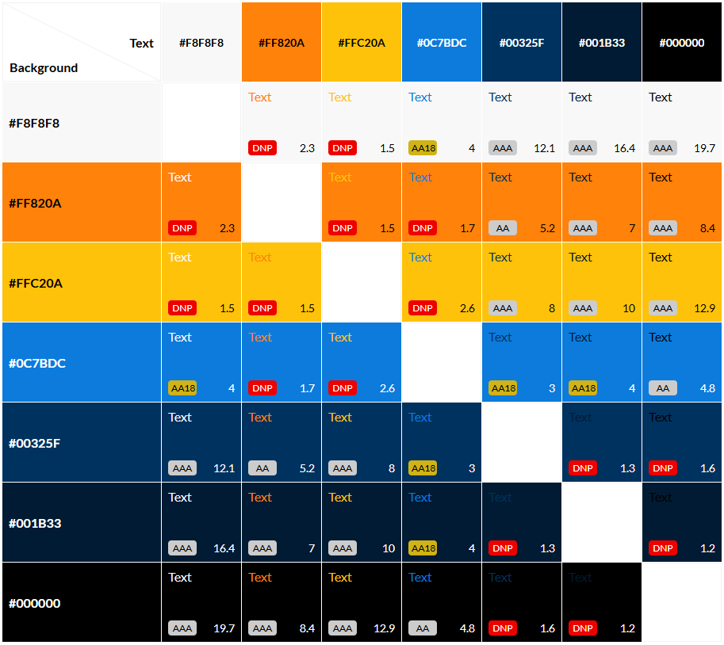
</details>
<details>
    <summary><strong>Adobe Colour Blindness simulator</strong></summary>
    <p>Used Adobe Colour blindness simulator, this tool verifies these colours are perceived with enough contrast against common forms of colour-blindness. They seem safe for all viewing.
    <a href="https://color.adobe.com/create/color-accessibility" target="blank">Link to the adobe tool used.</a></p>
    
</details>

#### Typography

Used Google Fonts [Aleo](https://fonts.google.com/specimen/Aleo) and [Roboto](https://fonts.google.com/specimen/Roboto). Aleo for a bolder stylized typeface, to be used only on larger text, namely the logo. Whilst Roboto was used for remaining text as for best legibility.

#### Logo

The static logo uses Google Fonts' Aleo mentioned above.

#### Favicon

Created with [Favicon generator](https://favicon.io/favicon-generator/), I was able to select the same font and highlight colours of my palette. Didn't think there was a symbol or emoji that encapsulated the intention and style of the website, so opted for text. It has to be brief given the size the icon is, so it include the 'iGo' to include the subject and verb, to promote the action. the I was lowercased to help distinguish from potentially being read as an L.

<details>
    <summary><strong>Favicon</strong></summary>
    
</details>

## Technologies

- Languages used:
  - [HTML5](https://en.wikipedia.org/wiki/HTML5)
  - [CSS3](https://en.wikipedia.org/wiki/CSS)
  - [JavaScript](https://en.wikipedia.org/wiki/JavaScript)
- [GitPod](https://www.gitpod.io/) - Cloud-based IDE to edit code and Git version control.
- [GitHub](https://github.com/) - to store and publish the project.
- [Google Fonts](https://fonts.google.com/) - to import fonts "Bree Serif" and "Patua One" into the website's CSS.
- [Font Awesome](https://fontawesome.com/) - to import icons for more recognizable action buttons. It has been used in:
  - The expandable Nav bar on narrow displays.
  - The X icon in expandable projects section.
  - The clear and submit form.
  - The contact platforms in the footer.
- [FavIcon generator](https://favicon.io/) - used to create the favicons to embed on our site.
- [Am I Responsive](https://ui.dev/amiresponsive) - to visualise the website in various display sizes.
- [Contrast grid](https://contrast-grid.eightshapes.com/) - to verify colour contrast for legibility
- [Adobe Color](https://color.adobe.com/create/color-wheel) - to generate the colour palette and Accessibility tools checking for contrast for legibility and colour-blind viewing.
- [W3C HTML Validator](https://validator.w3.org/) - to validate the HTML code.
- [W3C CSS Validator](https://jigsaw.w3.org/css-validator/) - to validate the CSS code.
- [JS hint](https://jshint.com/) - to validate the JS code.

## Security practices

<!-- Explanation of measures implemented in front-end, like handling secret keys -->

Following the practices learnt in the project walkthrough, I implemented similar features.

### Authentication and Permissions

Implemented with Django AllAuth to include user sign up and sign in. As standard, new users are not given superuser status so they do not have access to the admin panel where they could have access to some private content or able to delete or chaneg other user details.

With the implementation of Django signals too, on creation of the user, a profile is also generated automatically.

### CSRF Tokens

Cross-Site Request Forgery (CSRF) tokens were used to prevent unauthorized requests from potentially malicious websites. Though this is intended for cross-site use, due to a bug in logging in on the site on mobile devices, our project is setup as a unified server, so it only refers back to the API in the same domain and circumvents some of the issues seen with some browsers incompatibility.

### Defensive Design

The site validates user input and presents error messages to provide feedback on the error. Users whose CSRF Token has expired cannot navigate to an edit form and are redirected to the Sign in page.

<!-- Component Usage -->
<!-- Details on the use of React components, inc Architecture and component composition -->

## Deployment Process

<!-- Step-by-step guide on how to deploy the Front-end application -->

### Unified Project Setup

#### Starting a React project

To overcome the [issue with CSRF](#csrf-tokens) where browsers that set cross-site tracking protection by default, the frontend was setup in the same project as the backend following guidance from Code Institute. This way browsers will no longer block the cookies (and JSONWebToken) required for authentication.

1. In VS Code with our project opened, the command `mkdir frontend` was entered into the terminal. This created a new folder called **frontend** in our root directory.
1. In the terminal `cd frontend` was entered to change directory to our new folder.
1. Via the terminal, the command `node -v` was run to confirm Node.js v16 was installed and selected.
1. Then, the dependencies used for the walkthrough project were installed, by entering the following command:
   > `npx create-react-app . --template git+https://github.com/Code-Institute-Org/cra-template-moments.git --use-npm`<br>
   > This command uses code institute's template to install the dependencies.
1. The terminal prompted for confirmation, so typed `y` and hit enter. This step takes a while to install all the dependencies.
1. Once dependencies were installed, our filepath was confirmed by running `pwd` in the terminal. The next step must be carried out whilst inside the frontend folder.
1. The **.git** folder, **.gitignore** file and **README.md** file within the frontend folder were deleted, since they already existed in the root directory. Done by running the command:
   ```
   rm ".git", ".gitignore", "README.md" -Recurse -Force
   ```
1. In the terminal, whilst still inside the frontend directory, the command `npm start` was run, to see a react app would run successfully. The React app automatically opens on the browser, but should it not, it can be opened by holding **CTRL** or **CMD** and clicking on the localhost URL displayed in the terminal.
1. The Application is stopped running by pressing **CTRL+C**, this often prompted to "Terminate batch job (Y/N)?" to which we typed "y" and hit enter.
1. Moved back to the root directory with the command `cd ..`.
1. Then, to avoid pushing the large number of dependencies developping our React apps requires, inside **.gitignore** file in our root directory the line `**node_modules/` was added to make sure that no matter where this folder was kept, it would not be pushed to GitHub.
1. React was now installed, so I ran the commands:
   - `git add .` to add modified files to the list of changes to commit.
   - `git commit -m "Created frontend react app in this unified repo"` to save and generate the commit of the change on the local (VS Code) repository.
   - `git push` to push all committed changes back to the repository on GitHub.

#### Preparing the Django API for development

In this stage the code producing the Django API needs to be adjusted to work in the singular repository.

1. To find the development environment URL, the server was run using `python manage.py runserver` and the URL was noted. This is the line starting **http://...** after "Starting development server at". Press CTRL+C or CMD+C to terminate the server.
1. In **env.py**, the DEV variable was commented out so the application responds with JSON only, just as the React App expects and not the REST framework's HTML.
1. **CLIENT_ORIGIN_DEV** environment variable was deleted.
1. A new variable **DEBUG** was added.
   ```python
   # leave DEBUG on when testing locally
   # once hidden, Django will look for static files in the staticfiles directory
   os.environ['DEBUG'] = '1'
   ```
1. Another variable **ALLOWED_HOST** was added to hold the development environment URL. Note: **http://** and the trailing slash / were **both** excluded.
   ```python
   os.environ['ALLOWED_HOST'] = (
       "127.0.0.1"
   )
   ```
1. Another variable **CLIENT_ORIGIN** was added to hold the development environment URL. Note: **Only** the trailing slash / was excluded.
   ```python
   os.environ['CLIENT_ORIGIN'] = (
       "http://127.0.0.1"
   )
   ```
1. The values of **DATABASE_URL** and **CLOUDINARY_URL** remained the same as set in the during the backend [project setup](#project-setup).
1. Next, **requirements.txt** was checked for the inclusion of **urllib3**, as it may have been installed automatically on installing Cloudinary. In our case it had not, so the following command was used:
   ```
   pip3 install urllib==1.26.15
   ```
1. Then, it was added to our requirements.txt file with the command:
   ```
   pip3 freeze > requirements.txt
   ```
1. Because the last command updates the requirements.txt file, it also reverted the name of **psycopg2** to include "-binary" suffix again. So it was edited to remove it again and saved. It must be included in the following format:
   ```
   psycopg2==2.x.x
   ```

#### Updating settings.py

1. Back in settings.py, **DEBUG** was set to the value of the DEBUG environment variable, so if the variable is present, django's debugging features are enabled.
1. **ALLOWED_HOSTS** was updated to include the ALLOWED_HOST environment variable. This section of the code should look like this:

   ```python
   # SECURITY WARNING: don't run with debug turned on in production!
   DEBUG = 'DEBUG' in os.environ

   ALLOWED_HOSTS = [
       os.environ.get('ALLOWED_HOST'),
       '127.0.0.1',
       'localhost',
   ]
   ```

1. Since the 2 sides of the project are being unified into one repository, the issues identified with [CSRF](#csrf-tokens) will no longer affect the project and the **CORS_ALLOWED_ORIGINS** list could be greatly reduced. The code was modified to the below.
   ```python
   CORS_ALLOWED_ORIGINS = [
       os.environ.get('CLIENT_ORIGIN')
   ]
   ```

#### Preparing React to connect to the Django API

1. Inside the file **package.json**, found in the frontend directory, a new key was added to the JSON object at the bottom of the file.
   ```json
   {
     {(...)},
     "engines": {
       "node": "16.19.1",
       "npm": "8.19.3"
     },
     // added the line below
     "proxy": "http://localhost:8000/"
   }
   ```
1. At this point the project is now ready for the React app to be developed on, however there was a change that needed to be made before deployment and as reminder the following steps were taken:

   1. In the terminal, moved from root to frontend/src directory with `cd frontend/src`.
   1. Then, a folder was created inside, called **api** with command `mkdir api`.
   1. Changed into the new api folder with `cd api`.
   1. Inside the api folder a new file was created with command `touch axiosDefault.js`.
   1. Moved back to the root directory with `cd ../../../`.
   1. The new file, **axiosDefault.js**, was opened and the following lines were added.

      ```javascript
      // IMPORTANT!!
      // Because this React app is running in the same workspace as the API,

      // there is no need to set a separate baseURL until you reach deployment.

      // Setting a baseURL before you reach deployment will cause errors
      ```

1. The files were saved and changes commited:
   - `git add .` to add modified files to the list of changes to commit.
   - `git commit -m "Add settings to run react and API in the same development base URL"` to save and generate the commit of the change on the local (VS Code) repository.
   - `git push` to push all committed changes back to the repository on GitHub.

#### Running the project locally

1. On a new terminal, it was split it into 2 separate ones.
1. Terminal 1, making sure it was at the **root** directory, the command `python manage.py runserver` was run to start the Django API server.
1. Terminal 2, making sure it was in the **frontend** directory, the command `npm start`.
1. Once built, the react app opened automatically in our browser. To terminate both, pressing CTRL+C or CMD+C in each terminal shut each down in turn.

### Deployment

#### Set up for static files

Since the React app has static files, in this unified repository we needed to install WhiteNoise to store these for deployment.

1. In the terminal, making sure it is in the root directory, WhiteNoise was installed with the command:
   ```
   pip3 install whitenoise==6.4.0
   ```
1. Then, it was added to our requirements.txt file with the command:
   ```
   pip3 freeze > requirements.txt
   ```
1. A new folder called **staticfiles** was created to hold these files, the command used:
   ```
   mkdir staticfiles
   ```
1. In settings.py, in the INSTALLED_APPS list, **'django.contrib.staticfiles'** was added **above** 'cloudinary_storage'. This makes Whitenoise the primary package for dealing with static files.
   ```python
   INSTALLED_APPS = [
       (...),
       'django.contrib.messages',
       'django.contrib.staticfiles',
       'cloudinary_storage',
       'cloudinary',
       'rest_framework',
       (...)
   ]
   ```
1. Then, in the **MIDDLEWARE** list, WhiteNoise was added **below** the **SecurityMiddleware** and **above** **SessionMiddleware**.
   ```python
   MIDDLEWARE = [
       'corsheaders.middleware.CorsMiddleware',
       'django.middleware.security.SecurityMiddleware',
       'whitenoise.middleware.WhiteNoiseMiddleware',
       'django.contrib.sessions.middleware.SessionMiddleware',
       (...),
   ]
   ```
1. In **TEMPLATES** list, the following value was added to the DIRS key so Django and WhiteNoise know where to find the React app's index.html for deployment.
   ```python
   TEMPLATES = [
       {
           'BACKEND': 'django.template.backends.django.DjangoTemplates',
           # --- Change line below
           'DIRS': [os.path.join(BASE_DIR, 'staticfiles', 'build')],
           # ---
           'APP_DIRS': True,
           (...),
       },
   ]
   ```
1. In the **static files** section, **STATIC_ROOT** and **WHITENOISE_ROOT** variables and values were added to specify the location of files for admin files and React's static files during deployment.

   ```python
   # Static files (CSS, JavaScript, Images)
   # https://docs.djangoproject.com/en/3.2/howto/static-files/

   STATIC_URL = '/static/'
   STATIC_ROOT = BASE_DIR / 'staticfiles' # Added here
   WHITENOISE_ROOT = BASE_DIR / 'staticfiles' / 'build' #Added here
   ```

#### Configuring route for frontend view

As the project is unified, the backend (API) and frontend (React app) need to have their separate URL routes configured to prevent clashing URLs and make sure errors are handled in the frontend.

1. In the urls.py file of our API app (off_i_go), the **TemplateView** from generic Django views was imported.
   ```python
   from django.contrib import admin
   from django.urls import path, include
   from django.views.generic import TemplateView #Added here
   from .views import (
       logout_route,
       root_route,
   )
   ```
1. In the urlpatterns list, **root_route** was replaced with the generic template view.
   ```python
   urlpatterns = [
       path('', TemplateView.as_view(template_name='index.html')),
       (...),
   ]
   ```
1. Then, at the bottom of the file, the 404 handler was added to get React to handle these errors.
   ```python
   handler404 = TemplateView.as_view(template_name='index.html')
   ```
1. Then, to set the API urls apart, all API urls paths were prepended with **api/** and a new path for API root was added too using just 'api/' as the path.
   ```python
   urlpatterns = [
       (...),
       path('api/', root_route),
       path('api/api-auth/', include('rest_framework.urls')),
       # the logout route has to be above the default route to be matched first
       path('api/dj-rest-auth/logout/', logout_route),
       path('api/dj-rest-auth/', include('dj_rest_auth.urls')),
       path(
           'api/dj-rest-auth/registration/', include('dj_rest_auth.registration.urls')
       ),
       path('api/', include('comment_reply.urls')),
       path('api/', include('comments.urls')),
       path('api/', include('followers.urls')),
       path('api/', include('posts.urls')),
       path('api/', include('profiles.urls')),
       path('api/', include('reactions.urls')),
       path('api/', include('medias.urls')),
   ]
   ```
1. In axiosDefault.js, since all the API urls have been prepended with 'api/' the baseURL here had to be adjusted to match.

   ```js
   import axios from "axios";

   axios.defaults.baseURL = "/api"; // Adjusted here
   axios.defaults.headers.post["Content-Type"] = "multipart/form-data";
   axios.defaults.withCredentials = true;

   export const axiosReq = axios.create();
   export const axiosRes = axios.create();
   ```

1. Changes were saved, committed and pushed to GitHub.

#### Collecting static files

Our code is ready to access our static files for both the Django admin panel and the React app, but need to collect these files into the nominated folders for it to render correctly. Each time there is a change to the files saved locally, this collection will need to be done again before running the server locally or deploying.

1. To collect the API static files, the terminal was set to be in the root directory, before running the command. On running the command, the terminal prompted for confirmation to overwrite existing files. This was confirmed with 'yes'.
   ```
   python manage.py collectstatic
   ```
1. Then, to compile the files for the React app, in a separate terminal, the directory was changed to the frontend folder with the command.
   ```
   cd frontend
   ```
1. A quick check for the version of Node.js was done with the command `node -v`, it returned the version in the format of **v16.x.x**.
1. Once a suitable version of Node.js was confirmed to be installed, the React app files were compiled with te following command. This took a couple of minutes to do.
   ```
   npm run build
   ```
1. Once compiled, the files are moved to the staticfiles folder with the command.
   ```
   mv build ../staticfiles/.
   ```
1. On repeating these steps to compile the new app, the old build folder needs to be deleted, either manually or with the following command, before we were able to run the previous command that moved our new build.
   ```
   rm "../staticfiles/build" -Recurse -Force
   ```
1. A quick check through the folder explorer confirmed the folders **admin** and **build** existed under the staticfiles folder.

#### Runtime.txt file

To ensure Heroku runs the correct version of Python, a runtime.txt file is added to specify this version.

1. in the root directory, a new file named **runtime.txt** was added and populated with the following.
   ```
   python-3.12.8
   ```

#### Correction to requirements.txt file

Since new libraries have been installed and updated into the requirements.txt file, the line for needed to be corrected.

1. The requirements.txt file was opened and the line for psycopg2 had the suffix **-binary** removed again and file was saved.

#### Testing the build

Before the project is pushed to GitHub and Heroku again, the build was tested locally to confirm it is setup correctly and rendering on the same server port.

1. All running servers were terminated with CTRL+C or CMD+C.
1. In env.py file, both **DEBUG** and **DEV** were commented out.
1. Back in the terminal, within the root directory, the Django server was run using `python manage.py runserver`.
1. Then, the localhost URL was opened in the browser, which displayed the React app (without having to run a separated terminal for it).
1. On the React app displaying and functioning correctly, it was committed and pushed to GitHub. Ready to deploy on Heroku.

#### Deploying on Heroku

Since the project is unified, the Heroku application is the same as was set for the API, [see here](#deployment-to-heroku), but a couple of new environment variables needed to be added.

1. Logged in to Heroku and navigated to the dashboard for our application.
1. Then accessed **Settings** and expanded **Config Vars**.
1. The variable **ALLOWED_HOST** was added to hold the Heroku URL. Note: **http://** and the trailing slash / were **both** removed.
1. Another variable **CLIENT_ORIGIN** was added to hold the Heroku URL. Note: **Only** the trailing slash / was removed.
1. The variable **CLIENT_ORIGIN_DEV** was deleted from our config.
1. Finally, as the latest files had been pushed to GitHub the app was deployed by navigating to the Deploy tab and clicking the 'Deploy branch' button.

### Github Local Deployment

There are many ways to deploy the project locally on your own device. Forking, Cloning, GitHub Desktop and Zip Exctraction, the steps in these processes are outlined below:

#### Forking the GitHub repo

If you want to make changes to the repo without affecting it, you can make a copy of it by 'Forking' it. This will make sure that the original repo remains unchanged.

1. Log in to your GitHub account.
1. Navigate to the [repository](https://github.com/dasic002/off-i-go/tree/v2-0).
1. Select the 'Fork' button in the top right corner of the page (under your account image).
1. The repo has now been copied into your own repos and you can work on it in your chosen IDE.
1. If you have any suggestions to make regards to the code to make the site better, you can put in a pull request.

### Cloning the repo with GitPod

1. Log in to your GitHub account.
1. Navigate to the [repository](https://github.com/dasic002/off-i-go/tree/v2-0).
1. Select the 'Code' button above the file list on the right hand side.
1. Ensure HTTPS is selected and click the clipboard on the right of the URL to copy it.
1. Open a new workspace in GitPod.
1. In the bash terminal type 'git clone [copy url here from step 4]'.
1. Press enter - the IDE will clone and download the repo.

### Github Desktop

1. Log in to your GitHub account.
1. Navigate to the [repository](https://github.com/dasic002/off-i-go/tree/v2-0).
1. Select the 'Code' button above the file list on the right hand side.
1. Select 'Open with GitHub Desktop'.
1. If you haven't already installed GitHub desktop application - you will need to follow the relevant steps to do this.
1. The repo will then be copied locally onto your machine.

### Download and extract the zip directly from GitHub

1. Log in to your GitHub account.
1. Navigate to the [repository](https://github.com/dasic002/off-i-go/tree/v2-0).
1. Select the 'Code' button above the file list on the right hand side.
1. Select 'Download Zip'.
1. Once you have the Zip downloaded, open it with your prefered file decompression software.
1. You can then drag and drop the files from the folder into your chosen IDE or view/edit them on your local machine.
1. If you want to create a web-app from the repo please follow the instructions in [Deployment](#deployment).

# Back-End documentation

## API Overview

<!-- A description of the API, including its functionality and how it integrates with the Front-End -->

Off I Go has a Django API backend responsible for managing CRUD functions on our PostgreSQL database.

## Database design

<!-- Structure of the database, including custom models used -->

The database schematic was drawn up as soon as we had the User Stories defined and Wireframes drafted, as they provide direction on what information we want users to have access to, how they can create, read, update and delete it.

Visualising how a user might go about planning their journey, what considerations they need to make and still be inspired on what things to do and see, I pictured the site being based on posts with photos, videos and a location on a map.

The ERD below illustrates the intended database design for our site, those with a checkmark represent the models and fields built into our application.
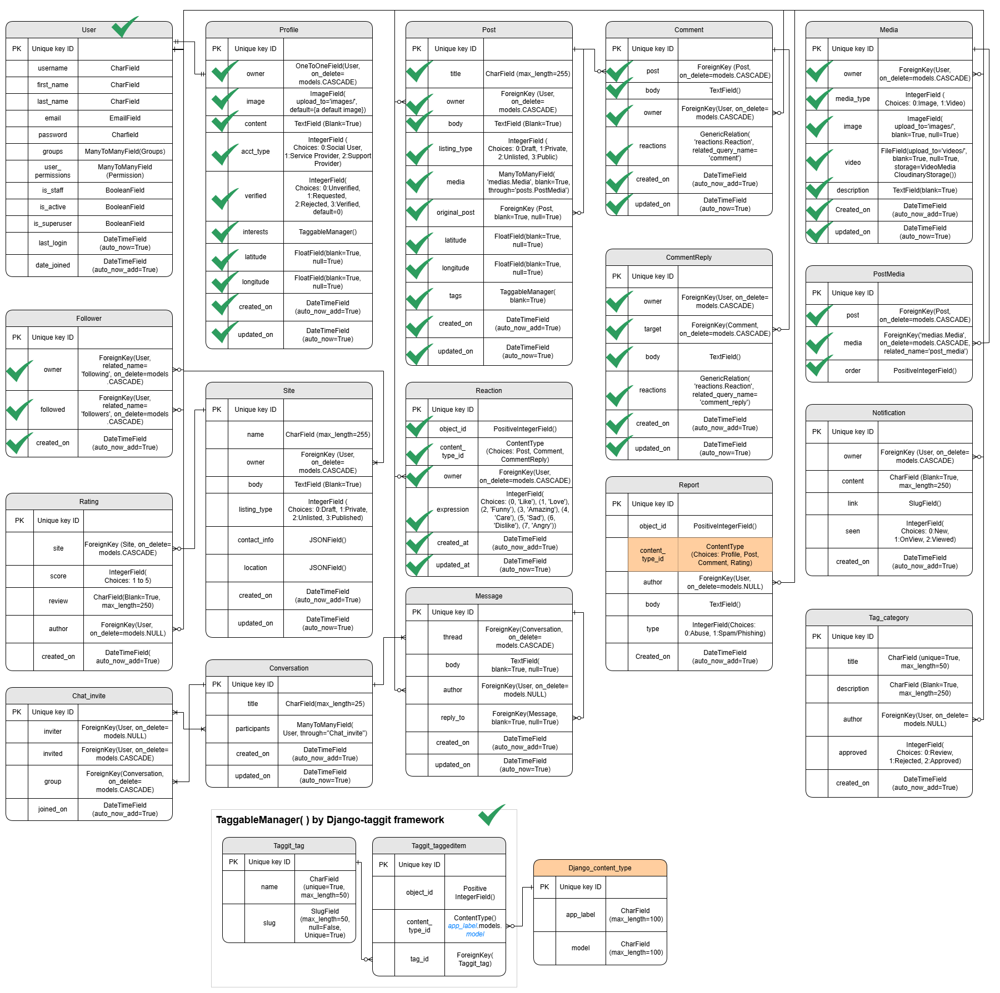

### Apps

Below is a list of applications that make up the Off I Go API with a summary of their purpose and how their are used on the Front-end.

#### Comments

Purpose: records comments made by a user/profile against a given post, to be called back by user or post.

Similar to the app created in the Code Institute walkthrough project, it records the body of text for the comment made, date it was created and last updated, as well as reactions made on the comment using a generic relation field.
All fields are migrated to the database, however there is currently no front-end means of adding a reaction against the comment.

**API endpoints:**

- `/comments/` to list (GET) or create (POST) comments.
- `/comments/<int:pk>/` to display (GET), update (PUT) or delete (DELETE) a single comment.

#### Comment_reply

Purpose: records comments as replies made by a user/profile to an existing comment on a post.

Originally this was going to be a self-referring model, but in discussion with my mentor, I came to realise this could get messy quickly and if a user were to delete their reply, especially when I was considering having the Foreign key turn to Null on a parent deletion. After a discussion with my mentor, I decided to go for a comment reply model to record replies made to 1st line comments on the post for a safer structure.

Similar to comments, it records a body of text of the reply, the date is was created and last updated, as well as reactions made on the reply using a generic relation field.

All fields are migrated to the database, however this functionality is not available on the front-end yet.

**API endpoints:**

- `/comment-replies/` to list (GET) or create (POST) comment replies.
- `/comment-replies/<int:pk>/` to display (GET), update (PUT) or delete (DELETE) a single comment reply.

#### Followers

Purpose: logs the followings between profiles to help filter posts by profiles others are interested in.

Just like the app created in the Code Institute walkthrough project, it logs one way relations of a profile following another.

**API endpoints:**

- `/followers/` to list (GET) or create (POST) followings.
- `/followers/<int:pk>/` to display (GET) or delete (DELETE) a single following.

#### Medias

Purpose: To log all media files a user uploads when the user creates a Post.

Instead of creating a field in the Post model to track an image URL, I opted for a separate model to track instances of either photo or video, so that these were independent from a Post instance. This affords us the flexibility to:

- use media files on objects other than Post instances, such as comments or messaging.
- attach the image or video to more than one object so the user can reuse an image in their existing gallery.
- if an object allows for, we can attach multiple files to a Post or Comment.

The model logs the media type, the cloudinary URL for the file, a string of text for the user to add a description for the image and date created and last updated.

Currently, all fields are migrated to the database, however the front-end form available can only log owner and images URL and is set to always assume the media type is an image.

**API endpoints:**

- `/medias/` to list (GET) or create (POST) media files.
- `/medias/<int:pk>/` to display (GET), update (PUT) or delete (DELETE) a single following.

#### Posts

Purpose: holds data on Posts users can create to share information on the platform.

Based on the app created in the Code Institute walkthrough project, it records a title and a body of text for the post content, date it was created and last updated, but also logs:

- media files used, with a Many-to-many field through our own intermediary model (PostMedia).
- listing type, so the user can create a post as draft, private, unlisted or published.
- original post, when the user's post is making reference to an existing post.
- reactions made on the post using a generic relation field.
- tags, using django taggit framework.
- latitude and longitude as FloatFields to log coordinates of the location the post is referring to.

All fields are migrated to the database, however there is currently no front-end means of adding referening an existing post on reposting.

**API endpoints:**

- `/posts/` to list (GET) or create (POST) posts.
- `/posts/<int:pk>/` to display (GET), update (PUT) or delete (DELETE) a single post.

#### Profiles

Purpose: holds data for the user that is easily customised by the user.

Based on the app created in the Code Institute walkthrough project, it has a one-to-one relation to the User model, so upon registration, a profile is created automatically. The user can then log in and access a form to update the profile with a more details. It logs the user it is attached to, content, date created and last updated, as well as:

- account_type - to distinguish the user the social users from Service/Support providers.
- verified (status) - to log whether a profile is officially verified and a reliable source.
- interests - which links to the django taggit framework, to match posts to relevant tags the user is interested in.
- latitude and longitude - FloatFields to log the coordinates the user wants to name as home for them so we can filter posts relevant to their location.

The location coordinates is only available on the API if the user to whom the profile belongs to is logged in.

All fields migrated to the database, but currently the is no front-end form to for the user to change their account_type, request verification or add tags they are interested in.

Spite creating the API view that allows deletion of a profile, this is not enabled on the front-end as we'd need to also enable deletion of the user from the auth model too.

**API endpoints:**

- `/profiles/` to list (GET) or create (POST) profiles.
- `/profiles/<int:pk>/` to display (GET), update (PUT) or delete (DELETE) a single profile.

#### Reactions

Purpose: logs users' reactions to posts, comments and comment-replies.

Users can only have one reaction per object and since this model can reference 3 other models in a Generic Foreign Key, it tracks content_type and object_id using Django's implicit Content_type model. The Unique_together parameter is set between user (as owner of reaction), content_type and object_id. The user can choose one of 8 types of reaction to have to another object.

Though our detail API view is setup for GET, PUT and DELETE, the front-end is no set up to use the PUT call, this is due to a UX choice that should a user want to delete an existing reaction it is easier to just click on it to remove, rather than expand a menu to then delete.

**API endpoints:**

- `/reactions/` to list (GET) or create (POST) reactions.
- `/reactions/<int:pk>/` to display (GET), update (PUT) or delete (DELETE) a single a single reaction.

## Security Measures

<!-- Details on security practices in the back-end, including handling of sensitive data -->

To ensure all data serialised on an API call is relevant or permitted for viewing by the current user, I have implemented 2 forms of checks.

- in Serializers I have it check if the user in the context request, is authenticated and is the owner of the instance being accessed before displaying the information.
- in Serializers I have it catch integrity errors thrown from the model/database based on restrictions we put in place, such as `unique_together` or required fields.
- in Generic views, permissions_classes has been provided with boolean outputs using rest_framework's permissions library.

## Setup and Deployment Process

<!-- Instructions for deploying the Back-end application -->

### Project Setup

Having only just migrated from GitPod to VS Code, I opted to use CI's template on GitHub before linking it to my local repository in VS Code.

1. In GitHub, I created a new repository using [Code Institute's template](https://github.com/Code-Institute-Org/ci-full-template) and named my new repository **off-i-go**.
1. Then, in VS Code, I opened the folder where I intended to keep my local repository and via the terminal I ran the command, `git clone https://github.com/dasic002/off-i-go` to clone the repository on GitHub.
1. After VS Code was done cloning the repository, I opened the folder in VS code for the project just downloaded and activated my virtual environment with the following steps:
   1. Clicked the gear icon on the bottom left corner of the screen to open the Manage menu and selected Command Palette to open the VS Code command palette.
   1. Typed "Create Environment" and selected the option "Python: Create Environment…"
   1. Selected "Venv" for a virtual environment, then selected "Python 3.12.8" and clicked "OK" with none of the checkboxes for dependencies checked.
   1. Once the virtual environment was created, I added ".venv" to the .gitignore file to avoid uploading the libraries to the repository, as they'll be installed in Heroku upon deployment.
1. With the Virtual Environment setup, I then installed Django using the command `pip3 install 'django<4'`.
1. Then, to start the project I used the command `django-admin startproject off_i_go . `.
   > - The `.` (dot) initialises the project in the current directory.
   > - I didn't add a suffix of api to my project as my intent was to have a unified project to get around the CSRF issue logging in on [mobile devices](#csrf-tokens).
1. Installed the Cloudinary library using the command `pip install django-cloudinary-storage`, so we can link our project with our Cloudinary bank of images.
1. Installed the Pillow library using the command `pip install Pillow`, which provides some image processing capabilities.
1. Inside settings.py file, I added the newly installed apps, paying attention to the order of apps in the list:
   ```python
   INSTALLED_APPS = [
       'django.contrib.admin',
       'django.contrib.auth',
       'django.contrib.contenttypes',
       'django.contrib.sessions',
       'django.contrib.messages',
       'cloudinary_storage', # NOTE: storage listed above staticfiles
       'django.contrib.staticfiles',
       'cloudinary', # NOTE: cloudinary listed last here
   ]
   ```
1. Created an env.py file in the top directory and added the following content:
   ```python
   import os
   os.environ["CLOUDINARY_URL"] = "cloudinary://API KEY HERE" # sourced from my cloudinary portal
   ```
1. Back in settings.py, I set up my cloudinary credentials and defined both the media URL and default file storage as:

   ```python
   import os

   if os.path.exists('env.py'):
       import env

   CLOUDINARY_STORAGE = {
       'CLOUDINARY_URL': os.environ.get('CLOUDINARY_URL')
   }
   MEDIA_URL = '/media/'
   DEFAULT_FILE_STORAGE = (
       'cloudinary_storage.storage.MediaCloudinaryStorage'
   )
   ```

1. Created the **requirements.txt** file to record the libraries installed with the command `pip freeze --local > requirements.txt`.
1. The project in VS Code at this point is now ready to be be developped upon, so I ran the commands:
   - `git add .` to add modified files to the list of changes to commit.
   - `git commit -m "Install django and cloudinary"` to save and generate the commit of the change on the local (VS Code) repository.
   - `git push` to push all committed changes back to the repository on GitHub.

### Deployment

#### Installing Django REST Framework

1. In the VS Code terminal the command `pip install djangorestframework==3.12.4` was run to install the Django REST Framework library. It serialises the database info into JSON format the frontend app will expect to see.
1. Inside settings.py file, I added the rest_framework library to the apps list, paying attention to the order of apps in the list:
   ```python
   INSTALLED_APPS = [
       'django.contrib.admin',
       (...),
       'cloudinary',
       'rest_framework', # rest framework added at the end
   ]
   ```

#### Setting up JWT tokens (JSON web tokens)

1. The command `pip install 'dj-rest-auth<3'` was run to install Django rest auth library.
1. Inside settings.py file, I added the libraries needed to the apps list, paying attention to the order of apps in the list:
   ```python
   INSTALLED_APPS = [
       'django.contrib.admin',
       (...),
       'rest_framework',
       'rest_framework.authtoken', # Added here
       'dj_rest_auth', # Added here
   ]
   ```
1. Inside urls.py file, the urls for the libraries installed were added:
   ```python
   urlpatterns = [
       path('admin/', admin.site.urls),
       path('api-auth/', include('rest_framework.urls')),
       path('dj-rest-auth/', include('dj_rest_auth.urls')), # dj-rest-auth added here
       path('', include('comments.urls')),
       path('', include('profiles.urls')),
       path('', include('posts.urls')),
       path('', include('reactions.urls')),
   ]
   ```
1. The installation of the Django rest auth library was completed with the command `python manage.py migrate` to migrate the changes to our database.
1. Back in settings.py file, I added the following to installed_apps list:
   ```python
   INSTALLED_APPS = [
       'django.contrib.admin',
       (...),
       'dj_rest_auth',
       'django.contrib.sites', # Added here
       'allauth', # Added here
       'allauth.account', # Added here
       'allauth.socialaccount', # Added here
       'dj_rest_auth.registration', # Added here
   ]
   ```
1. Also in settings.py, just below INSTALLED_APPS list, I added a new variable `SITE_ID = 1`.
1. Inside urls.py file, the urls for the user registrations were added:

   ```python
   urlpatterns = [
       (...),
       path('dj-rest-auth/', include('dj_rest_auth.urls')),
       #----
       path(
           'dj-rest-auth/registration/', include('dj_rest_auth.registration.urls')
       ), #---- Added here
       path('', include('comments.urls')),
       (...),
   ]
   ```

1. Then, the command `pip install 'djangorestframework-simplejwt<35.4'` was run to install the JSON tokens with simple jwt library.
1. To be able to login into our APIs during development, we need to add a variable in the environment so we can switch between DEV (working locally) and Production/Deployed (running on the server). For this the following was added:
   1. to our env.py file:
      ```python
      os.environ['DEV'] = '1'
      ```
   1. to our settings.py file, below the line that reads `BASE_DIR = Path(__file__).resolve().parent.parent`:
      ```python
      REST_FRAMEWORK = {
        'DEFAULT_AUTHENTICATION_CLASSES': [(
          'rest_framework.authentication.SessionAuthentication'
          if 'DEV' in os.environ
          else 'dj_rest_auth.jwt_auth.JWTCookieAuthentication'
          )]
      }
      ```
1. Below the `REST_FRAMEWORK` value in settings.py the following variables were added:
   ```python
   REST_USE_JWT = TrueAdd commentMore actions
   JWT_AUTH_SECURE = True
   JWT_AUTH_COOKIE = 'my-app-auth'
   JWT_AUTH_REFRESH_COOKIE = 'my-refresh-token'
   ```
1. Then, serializers.py file was created in our project folder **off_i_go** and populated with the following code copied from Code Institute's walkthrough [guide](https://github.com/Code-Institute-Solutions/drf-api/blob/c637122d1a559139cabf1d39b0a3281814091d79/drf_api/serializers.py):

   ```python
   from dj_rest_auth.serializers import UserDetailsSerializer
   from rest_framework import serializers


   class CurrentUserSerializer(UserDetailsSerializer):
       profile_id = serializers.ReadOnlyField(source='profile.id')
       profile_image = serializers.ReadOnlyField(source='profile.image.url')

       class Meta(UserDetailsSerializer.Meta):
           fields = UserDetailsSerializer.Meta.fields + (
               'profile_id', 'profile_image'
           )
   ```

1. Then, the default USER_DETAILS_SERIALIZER in settings.py was overwritten by adding the following code, below the line reading `JWT_AUTH_REFRESH_COOKIE = 'my-refresh-token'`:
   ```python
   REST_AUTH_SERIALIZERS = {Add commentMore actions
       'USER_DETAILS_SERIALIZER': 'off_i_go.serializers.CurrentUserSerializer'
   }
   ```
1. The installation of the JSON Web Token authentication was completed with the command `python manage.py migrate` to migrate the changes to our database.
1. Updated the **requirements.txt** file to record the libraries installed with the command `pip freeze --local > requirements.txt`.
1. To save and push the changes made, the commands were run:
   - `git add .` to add modified files to the list of changes to commit.
   - `git commit -m "Add JSON web tokens to the project and configure"` to save and generate the commit of the change on the local (VS Code) repository.
   - `git push` to push all committed changes back to the repository on GitHub.

#### Preparing the API for deployment

1. In **off_i_go** project folder, I added a views.py file and populated it with:

   ```python
   from rest_framework.decorators import api_view
   from rest_framework.response import Response


   @api_view()
   def root_route(request):
       return Response({
           "message": "Welcome to Off I Go API",
       })
   ```

   NOTE: As the Project was unified, some of the code in this process changes at the point we prepare the project to work on the frontend.

1. In the main urls.py file (inside _off_i_go_ folder), the view created is imported and added to the urlpattern list:

   ```python
   from .views import root_route

   urlpatterns = [
     path('', root_route),
   ]
   ```

1. In settings.py, within **REST_FRAMEWORK** variable, the pagination class parameters were added, this will return the data on the API in chunks so the frontend does not have a long loading times to display some data. The section below was added:
   ```python
   REST_FRAMEWORK = {
       'DEFAULT_AUTHENTICATION_CLASSES': [(
           'rest_framework.authentication.SessionAuthentication'
           if 'DEV' in os.environ
           else 'dj_rest_auth.jwt_auth.JWTCookieAuthentication'
       )],
       # --- section added ---
       'DEFAULT_PAGINATION_CLASS':
           'rest_framework.pagination.PageNumberPagination',
       'PAGE_SIZE': 10,
       # --- end of section ---
   }
   ```
1. Below the **REST_FRAMEWORK** variable, a condition was added to set the default renderer to JSON, should the environment variable for **DEV** be falsy (or non-existent):
   ```python
   if 'DEV' not in os.environ:
       REST_FRAMEWORK['DEFAULT_RENDERER_CLASSES'] = [
           'rest_framework.renderers.JSONRenderer'
       ]
   ```
1. Then, to improve the legibility of the dates (for variables such as _created_on_ or _updated_on_), a datetime format was specified with following line:
   ```python
   REST_FRAMEWORK = {
       (...),
       'DEFAULT_PAGINATION_CLASS':
           'rest_framework.pagination.PageNumberPagination',
       'PAGE_SIZE': 10,
       'DATETIME_FORMAT': '%d %b %Y', # Added here
   }
   ```
1. Additionally, for better UX, serializers.py files for items such as comments or notifications a natural time function was added so the user is told how long ago from the time of loading the data to when the data was created.

   ```python
   # added in imports
   from django.contrib.humanize.templatetags.humanize import naturaltime

   # added inside the Serializer Class
   # returns a humanized representation of the time since the comment was created
   def get_created_at(self, obj):
       return naturaltime(obj.created_at)

   # returns a humanized representation of the time since the comment was last updated
   def get_updated_at(self, obj):
       return naturaltime(obj.updated_at)
   ```

1. To save and push the changes made, the commands were run:
   - `git add .` to add modified files to the list of changes to commit.
   - `git commit -m "Prepare to deploy to Heroku"` to save and generate the commit of the change on the local (VS Code) repository.
   - `git push` to push all committed changes back to the repository on GitHub.

#### Create a Database

##### Via Code Institute's database maker

If you are a current student of Code Institute, you should have access to their [database maker service](https://dbs.ci-dbs.net)

- Enter your email address linked to your LMS Portal.
- The database will be generated and an email with the details will be sent to you.
- The email will contain a management URL that is unique to you and will offer the options to view details for linking to your project or delete the database.

##### Via ElephantSQL

- Create an account and log in with ElephantSQL.com.
- From the dashboard click “Create New Instance”.
- Set up your plan
  - Give your plan a Name
  - Select a plan tier
  - You can leave the Tags field blank
- Select “Select Region”
- Select a data center near you
- Then click “Review”
- Check your details are correct and then click “Create instance”
- Return to the ElephantSQL dashboard and click on the database instance name for this project
- In the URL section, click the copy icon to copy the database URL
- In your env.py file replace `<copiedURL>` in the DATABASE_URL environment variable with the copied URL.
- Save the file.

#### Deployment to Heroku

1. Logged into Heroku and navigated to the dashboard.
1. Clicked on **New** to expand a menu and selected **Create new app**.
1. The app was given the an appropriate name, in our case "off-i-go-2-0" since it was unique, and the region selected was the closest to developper, this case "Europe".
1. Navigated to the settings tab of the app and clicked on **Reveal Config Vars** to make the variables visible.
1. Added the Config var of key **DATABASE_URL** and value being the url sourced on creating the database.
1. To connect our project to the PostgreSQL database the following steps were required:

   1. Back in VS Code, dj_database_url, psycopg2-binary, and setuptools were installed by running the following command in the terminal:<br>
      `pip3 install dj_database_url==0.5.0 psycopg2-binary setuptools`
   1. Then, in settings.py, dj_database_url library was imported just below the os import:
      ```python
      import os
      import dj_database_url # Added here
      ```
   1. To use the local SQL database file during development locally and switch to the PostgreSQL database in the deployed app, a conditional statement is created further down in settings.py. The **DATABASES** section was replaced with the following:

      ```python
      # Database
      # https://docs.djangoproject.com/en/3.2/ref/settings/#databases

      if 'DEV' in os.environ:
          DATABASES = {
              'default': {
                  'ENGINE': 'django.db.backends.sqlite3',
                  'NAME': BASE_DIR / 'db.sqlite3',
              }
          }
      else:
          DATABASES = {
              'default': dj_database_url.parse(os.environ.get("DATABASE_URL"))
          }
      ```

   1. In the local env.py file, a new environment variable is added **DATABASE_URL** for the PostgreSQL url value we obtained earlier, adding the line:
      ```python
      os.environ['DATABASE_URL'] = "<your PostgreSQL URL here>"
      ```
   1. To verify our local repository can reach the database, the **DEV** environment variable was temporarily commented out.
      ```python
      os.environ['CLOUDINARY_URL'] = "cloudinary://..."
      os.environ['SECRET_KEY'] = "Z7o..."
      # os.environ['DEV'] = '1'
      os.environ['DATABASE_URL'] = "postgres://..."
      ```
   1. Then in settings.py, a print statement was added to confirm the conditional setting of default database was working correctly.
      ```python
      if 'DEV' in os.environ:
          (...)
      else:
          DATABASES = {
              'default': dj_database_url.parse(os.environ.get("DATABASE_URL"))
          }
          print('connected') # Added here
      ```
   1. Made sure those changes were saved locally, before running the following command:
      ```
      python manage.py makemigrations --dry-run
      ```
   1. The terminal printed the message "connected", indicating the link was setup correctly.
   1. The print statement back in settings.py was removed.
   1. Then, our models were migrated to the new database with the command:
      ```
      python manage.py migrate
      ```
   1. Then, a superuser was created using the following command and following the steps indicated:
      ```
      python manage.py createsuperuser
      ```

1. Next, gunicorn and django-cors-headers was installed with the command:
   ```
   pip3 install gunicorn 'django-cors-headers<4.6'
   ```
1. Updated the **requirements.txt** file to record the libraries installed with the command:
   ```
   pip freeze > requirements.txt`
   ```
1. **Procfile** file was created in main project folder, and populated with the following:
   ```
    release: python manage.py makemigrations && python manage.py migrate
    web: gunicorn off_i_go.wsgi:application
   ```
1. Back in settings.py, the value of **ALLOWED_HOSTS** variable was updated to include our Heroku app's URL.
   ```python
   ALLOWED_HOSTS = ['localhost', '127.0.0.1', '<your_app_name>.herokuapp.com']
   ```
1. Inside INSTALLED_APPS corsheaders was added:
   ```python
   INSTALLED_APPS = [
       (...)
       'dj_rest_auth.registration',
       'corsheaders', # Added here
       (...)
   ]
   ```
1. Inside MIDDLEWARE, corsheaders middleware was added to the top of the list:
   ```python
   SITE_ID = 1
   MIDDLEWARE = [
       'corsheaders.middleware.CorsMiddleware',
       (...)
   ]
   ```
1. Under MIDDLEWARE, CORS_ALLOWED_ORIGINS was set:
   ```python
   CORS_ALLOWED_ORIGINS = [
     origin for origin in [
       os.environ.get('CLIENT_ORIGIN'),
       os.environ.get('CLIENT_ORIGIN_DEV')
     ] if origin
   ]
   ```
1. And below this, sending of cookies in cross-origin requests was enabled with:
   ```python
   CORS_ALLOW_CREDENTIALS = True
   ```
1. So that the frontend app and API can be deployed on separate platforms, the JWT_AUTH_SAMESITE attribute was set to 'None', like so:
   ```python
   JWT_AUTH_COOKIE = 'my-app-auth'
   JWT_AUTH_REFRESH_COOKIE = 'my-refresh-token'
   JWT_AUTH_SAMESITE = 'None' # Added here
   ```
1. Replaced the SECRET_KEY with an environment variable to keep it hidden.
   ```python
   # SECURITY WARNING: keep the secret key used in production secret!
   SECRET_KEY = os.getenv('SECRET_KEY')
   ```
1. Then, in env.py a new value for the SECRET_KEY was set, with the help of a [key generator](https://djecrety.ir/).
   ```python
   os.environ.setdefault("SECRET_KEY", "<NEWRandomValueHere>")
   ```
1. Then, the DEV environment variable was commented back in.
   ```python
   os.environ['DEV'] = '1'
   ```
1. Back in settings.py, DEBUG was set on a conditional statement dependent on the environment variable DEV being present, if present, it will set the value to True.
   ```python
   DEBUG = 'DEV' in os.environ
   ```
1. Updated the **requirements.txt** file, once again, to record the libraries installed with the command:
   ```
   pip freeze > requirements.txt`
   ```
1. Then, manually edited the entry for psycopg2 in requirements.txt to delete the suffix of '-binary', since heroku will not recognise this. Making sure the file is saved prior to commiting these changes.
   ```python
   # OLD line
   psycopg2-binary==2.x.x
   # NEW line
   psycopg2==2.x.x
   ```
1. To save and push the changes made, the commands were run:
   - `git add .` to add modified files to the list of changes to commit.
   - `git commit -m "Add libraries deployed database"` to save and generate the commit of the change on the local (VS Code) repository.
   - `git push` to push all committed changes back to the repository on GitHub.
1. Back on the Heroku dashboard **Settings** tab for our API app, 3 more Config Vars were added:
   - **SECRET_KEY** - used the key generator tool again for a whole new key value.
   - **CLOUDINARY_URL** - copied the URL set in env.py file, without the quotation marks.
   - **DISABLE_COLLECTSTATIC** - this value was set as 1.
1. Then, navigated to Deploy tab and in the Deployment method section, selected **Connect to GitHub**.
1. Searched for our repo and clicked **Connect** and then clicked on **Enable Automatic Deploys** so further pushes automatically trigger deployments.
1. For this time, since the changes had already been pushed to GitHub, by reaching the **Manual deploy** section and clicking **Deploy Branch**, the API built and deployed. Thereafter, clicking on **Open app** displayed our JSON welcome message.

#### dj-rest-auth Bug Fix

The dj-rest-auth library has a bug that causes the logout view to not log users out properly. To fix this, following the guidance from Code Institute, we setup up own logout view which will set the access token and refresh token to empty strings, and in effect, resetting the access to the data only visible to logged in users.

1. In off_i_go/views.py, JWT_AUTH settings are imported from settings.py.
   ```python
   from .settings import(
       JWT_AUTH_COOKIE,
       JWT_AUTH_REFRESH_COOKIE,
       JWT_AUTH_SAMESITE,
       JWT_AUTH_SECURE,
   )
   ```
1. Then, a logout_route view is written as below:
   ```python
   # dj-rest-auth logout view fix
   @api_view(['POST'])
   def logout_route(request):
       response = Response()
       response.set_cookie(
           key=JWT_AUTH_COOKIE,
           value='',
           httponly=True,
           expires='Thu, 01 Jan 1970 00:00:00 GMT',
           max_age=0,
           samesite=JWT_AUTH_SAMESITE,
           secure=JWT_AUTH_SECURE,
       )
       response.set_cookie(
           key=JWT_AUTH_REFRESH_COOKIE,
           value='',
           httponly=True,
           expires='Thu, 01 Jan 1970 00:00:00 GMT',
           max_age=0,
           samesite=JWT_AUTH_SAMESITE,
           secure=JWT_AUTH_SECURE
       )
       return response
   ```
1. Once the logout_route view is built, it was imported into off_i_go/urls.py.
   ```python
   from .views import (
       logout_route,
       root_route,
   )
   ```
1. Then, imported into the urlpatterns list, carefully placing it above dj-rest-auth urls, so it matches it first when it is called upon.
   ```python
   urlpatterns = [
       (...),
       # the logout route has to be above the default route to be matched first
       path('dj-rest-auth/logout/', logout_route),
       path('dj-rest-auth/', include('dj_rest_auth.urls')),
       path(
           'dj-rest-auth/registration/', include('dj_rest_auth.registration.urls')
       ),
       (...),
   ]
   ```
1. To save and push the changes made, the commands were run:
   - `git add .` to add modified files to the list of changes to commit.
   - `git commit -m "Add logout view to overcome known bug"` to save and generate the commit of the change on the local (VS Code) repository.
   - `git push` to push all committed changes back to the repository on GitHub.
1. Automatic deploys were set, so the app was deployed with our latest push.

#### Setting ALLOWED_HOST variable

To add more flexibility to our deployed API, another environment variable was added to hold the deployed app url so it gets added to the list of ALLOWED_HOSTS wherever it gets deployed to as long as the Environment Variable exists.

1. In settings.py, the string for the Heroku app URL inside ALLOWED_HOSTS list was copied.
1. Back on Heroku's dashboard for the deployed API, Config Vars was expanded, and a new key of **ALLOWED_HOST** was added with value of the URL string copied earlier, without the quotation marks.
1. Back in settings.py in VS Code project, the Heroku app URL inside ALLOWED_HOSTS list was replaced with the ALLOWED_HOST environment variable.
   ```python
   ALLOWED_HOSTS = [
       os.environ.get('ALLOWED_HOST'),
       '127.0.0.1',
       'localhost',
   ]
   ```
1. To save and push the changes made, the commands were run:
   - `git add .` to add modified files to the list of changes to commit.
   - `git commit -m "Replace heroku string from ALLOWED_HOSTS and move to environment variables"` to save and generate the commit of the change on the local (VS Code) repository.
   - `git push` to push all committed changes back to the repository on GitHub.
1. Automatic deploys were set, so the app was deployed with our latest push.

At this point the project is ready for to use with the frontend React app.

# Code Standards and Practices

## Front-end Code standards
<!-- Info on coding standards followed, e.g. JSX coding practices, modular component use -->
### HTML validation
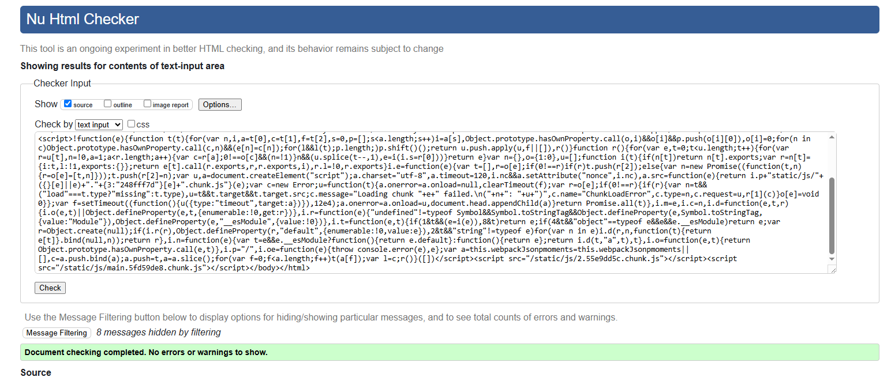

### CSS validation
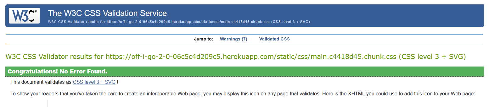


<!-- ## Back-end Code standards -->
<!-- Python coding standards followed, adhering to PEP8 guidelines -->

## Lighthouse testing

### Mobile
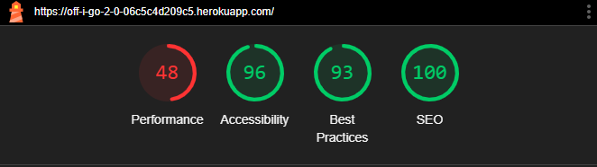

### Desktop
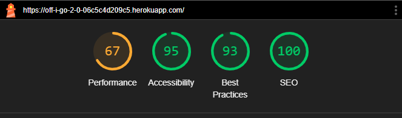

# Testing and version Control

## Manual testing
<!-- Documentation of manual testing procedures and results for both front end and back end -->

|Feature|Action|Expected Behaviour|Pass/Fail|Notes|
|---|---|---|---|---|
|Google Fonts|Loading the page|Google fonts load|PASS||
|Font Awesome icons|Loading the page|Icons appear as intended|PASS||
|Images|Loading the page|Images appear as intended|PASS||
|Content text|Loading the page|Text appears as intended|PASS||
|Nav bar appearance|Loading the page|Nav bar appears as expected, when display width is above 992px wide, the icons and names are displayed.|PASS||
|Nav bar appearance|Loading the page|Nav bar appears as expected, when display width is below 992px link names are hidden unless active.|PASS||
|Nav bar appearance|Loading the page|Nav bar appears as expected, when display width is below 768px menu is collapsed into hamburger icon.|PASS||
|Nav bar appearance|Loading the page|Nav bar appears as expected, when display width is below 500px Nav bar menu is moved to the bottom, into baseWidget, for mobile displays.|PASS||
|Nav Button - hamburger icon|Click Hamburger icon|hamburger icon toggles to reveal and collapse nav menu|PASS||
|Nav button - Active state|Click on any feeds or profile button in the Nav bar|Button highlights to show active state and when name has been hidden (< 992px wide), it is now revealed only on the active button.|PASS||
|Nav button - Sign up|Click button ""Sign up"" just after loading the site|Loads sign up page|PASS||
|Nav button - Sign in|Click button ""Sign in"" just after loading the site|Loads Sign in page|PASS||
|Nav button - Sign out|Click button ""Sign out""|Returns user to landing page and nav links change to Home, sign in and sign up.|PASS||
|Nav Button - Brand logo|Load page|Animated logo is rendered|PASS||
|Nav Button - Brand logo|Load page when logo artwork is unreachable|Static text logo matching font and scale is rendered in place of animated logo|PASS||
|Nav Button - Brand logo|Click brand ""Off I Go""|Returns user to landing page|PASS||
|Nav Button - Home|Click button ""Home""|Returns user to landing page|PASS||
|Nav Button - Add Post|Click button ""Add Post""|Loads form to create a new post|PASS||
|Nav Button - Discover|Click button ""Discover""|Loads feed with all of the most recent posts created|PASS||
|Nav Button - Feed|Click button ""Feed""|Loads feed with all of the most recent posts created by profiles the current user follows. Whilst user does not follow anyone, a ""No results"" message is displayed.|PASS||
|Nav Button - For me|Click button ""For me""|Loads feed with all of the most recent posts created that match your current tagged interests|PASS|Django taggit was not working correctly, so currently it just displays all.|
|Nav Button - Near me|Click button ""Near me""|Loads feed with all of the most recent posts created that have a global coordinates within a range from user's current coordinates.|PASS||
|Nav Button - Profile Avatar|Click Profile Avatar|Loads profile page.|PASS||
|Sign up - form - error messages|Submit with blank fields|Returns messages that field must not be blank|PASS||
|Sign up - form - error messages|Enter existing username to register|Returns message that Username exists|PASS||
|Sign up - form - error messages|Enter special characters into username to register|Returns message that Username is not valid|PASS||
|Sign up - form - error messages|Enter password that does not match between fields|Returns message that password fields did not match|PASS||
|Sign up - form - successful registration|Enter valid data to signup and submit|Redirects user to Sign in page|PASS||
|Sign up - redirect user|navigate to sign up page when already logged in|Redirects user to ""discover"" feed|PASS||
|Sign in - form - error messages|Submit with blank fields|Returns message must not be blank|PASS||
|Sign in - form - error messages|Submit with incorrect username or password|Returns message unable to login with credentials|PASS||
|Sign in - form - successful log in|Submit valid login details|Redirects user to previous page|PASS||
|Landing page - Content|Load page|Includes brief intro to the site, a button inviting users to sign up and artwork|PASS||
|Add Post - form|Click ""Add Post"" |Create post form renders as expected|PASS||
|Add Post - form|Submit blank form|Error message only that the title field must not be blank|PASS||
|Add Post - form|Submit form with just a title|Successfully adds a post with just a title|PASS||
|Add Post - form|Click to upload an image|Opens file explorer to select image|PASS||
|Add Post - form|Click ""Get Live Location""|Disables button whilst message advises it is retrieving location.|PASS||
|Add Post - form|Browser unable to retrieve location|Browser times out after 30 seconds retrieving the coordinates, displays warning message to say so and offers another button to use ""Cached location"" instead, disappears after 3 seconds.|PASS||
|Add Post - form|Click ""Try Cached Location""|If the browser has a cached location that is up to 10 minutes old, it will settle for this.|PASS||
|Add Post - form|Submit form with image, title, content, location, tags and set to public|User is redirected to the page for the given new post.|PASS||
|Add Post - form|Click ""Cancel""|Takes user to previous page|PASS||
|Edit Post - form|Expand the dropdown menu on post and select ""Edit post""|Edit post form renders as expected populated with post data ready to edit.|PASS||
|Edit Post - form|Replace image and submit|Successfully edits post, post is rendered with the new image.|PASS||
|Edit Post - form|Click ""Get Live Location""|Disables button whilst message advises it is retrieving location.|PASS||
|Edit Post - form|Browser unable to retrieve location|Browser times out after 30 seconds retrieving the coordinates, displays warning message to say so and offers another button to use ""Cached location"" instead, disappears after 3 seconds.|PASS||
|Edit Post - form|Click ""Try Cached Location""|If the browser has a cached location that is up to 10 minutes old, it will settle for this.|PASS||
|Edit Post - form|Submit form with changes to post|User is redirected to the page for the given changed post.|PASS||
|Edit Post - form|Click ""Cancel""|Takes user to previous page|PASS||
|Search posts bar in feed views|Typing text that's included in a profile name or post title.|Filters posts viewed that contain this text in either field.|PASS||
|Search posts bar in feed views|Type text that purposefully returns no posts.|No results found message is displayed and advises user on actions to take.|PASS||
|Feed view - Near Me - Radius field|Change value of radius.|Posts are filtered in or out as the radius increases or decreases.|PASS||
|Feed view - Near Me - Location button|Click the home location button|Posts are filtered by radius to the coordinates the given user has set as home. If none set, home location is defaulted to The Royal Greenwich Observatory's coordinates.|PASS||
|Most Followed profiles|Loading feeds or profile pages|A shortlist of most followed profiles is compiled, at 992px wide or above the list includes up to 10 profiles with a easy follow button on the side. Any narrower the list is reduced to 4 most followed without follow buttons.|PASS||
|Profile page - Other users|Loading the page|Displays profile stats, button to follow/unfollow, listing of their public or unlisted posts, another view to see posts they have commented on and posts they have reacted to.|PASS||
|Profile page - Current user profile|Loading the page|Displays profile stats, dropdown menu to manage account, listing of all their posts, another view to see posts they have commented on and posts they have reacted to.|PASS||
|Post component|Loading feeds or profile pages|Post component displays Owner Profile Avatar, name and date posted, a badge to indicate whether it is Unlisted, Private or Draft. Displays the media linked to the post, title, content, number of reactions and comments and tags attached. Finally, buttons to add a reaction, comments or view the location attached to the post in Google maps.|PASS||
|Post Page|Clicking post media or comment button|Loads page for single post listing all comments made on the given post.|PASS||
|Post Page - comment form|Submit blank form|""Post"" button disabled|PASS||
|Post Page - comment form|Submit form with comment|""Post"" button becomes enabled and comment successfully posted.|PASS||
|Comment component|Loading Post page|Displays commenter Avatar, name, time since comment was made and content.|PASS||
|Comment component - Dropdown menu|Loading Post page|If comment belongs to current user, dropdown menu appears to edit or delete the comment.|PASS||
|Profile edit form|Loading the page|Form is populated with profile info|PASS||
|Profile edit form|Click cancel|Returns to previous page|PASS||
|Profile edit form|Click ""Get Live Location""|Disables button whilst message advises it is retrieving location.|PASS||
|Profile edit form|Browser unable to retrieve location|Browser times out after 30 seconds retrieving the coordinates, displays warning message to say so and offers another button to use ""Cached location"" instead, disappears after 3 seconds.|PASS||
|Profile edit form|Click ""Try Cached Location""|If the browser has a cached location, no matter how old, it will settle for this.|PASS||
|Profile edit form|Submit form with image, bio, location and interests.|User is redirected to their profile page.|PASS||
|Username edit form|Submit blank form|Error message field must not be blank.|PASS||
|Username edit form|Submit changed username.|User redirected to profile page, username change is reflected in every mention of it and on login in the new username is needed.|PASS||
|Password edit form|Submit blank form|Error message field must not be blank.|PASS||
|Password edit form|Submit mismatching passwords|Error message two password fields do not match.|PASS||
|Password edit form|Submit a password shorter than 8 characters|Error message password too short.|PASS||
|Password edit form|Submit new password correctly|Successfully change, user is redirected to profile page and on log in new password is needed.|PASS||
|Page scaling - mobile|Viewing the page on mobile display in portrait|Font size is legible and the page does not require scrolling on timed buttons. No overlapping text or images.|PASS||
|Page scaling - mobile|Viewing the page on mobile display in landscape|Font size scales down to fit in the height of the display. Page includes left and right margins to keep content in the centre still.|PASS||
|Page scaling - desktop|Viewing the page on a desktop/laptop display in landscape with the browser taking the width of the display|Font size scales down to fit in the height of the display. Page includes left and right margins to keep content in the centre still.|PASS||
|Page scaling - desktop|Viewing the page on a desktop/laptop display in landscape with the browser taking the width of the display|Font size scales down to fit in the height of the display. Page includes left and right margins to keep content in the centre still.|PASS||


## User Story testing

|User Story|Priority|Link|Pass/Fail|Notes|
|---|---|---|---|---|
|As a **user** I can **see the nav bar from every page**, so that **I can easily navigate the site and find the various feeds and info**.|MUST have|[#1](https://github.com/dasic002/off-i-go/issues/1)|PASS||
|As a **user** I can **easily find the navigation links on any size display**, so that **it is still easy to navigate the site**.|MUST have|[#/2](https://github.com/dasic002/off-i-go/issues/2)|PASS||
|As a **user** I can **quickly navigate the website**, so that **content is displayed effortlessly**.|MUST have|[#/3](https://github.com/dasic002/off-i-go/issues/3)|PASS||
|As a **user** I can **see other profiles' Avatar and username**, so that **can easily identify and view their profile page**.|MUST have|[#10](https://github.com/dasic002/off-i-go/issues/10)|PASS||
|As a **logged out user** I can **see sign in/sign up links on the nav bar**, so that **I can sign back in or sign up**.|MUST have|[#11](https://github.com/dasic002/off-i-go/issues/11)|PASS||
|As a **user** I can **sign up**, so that **I can access all the features available**.|MUST have|[#/5](https://github.com/dasic002/off-i-go/issues/5)|PASS||
|As a **user** I can **sign in with my account details**, so that **I can use the functionalities available to me**.|MUST have|[#/6](https://github.com/dasic002/off-i-go/issues/6)|PASS||
|As a **user** I can **see whether I'm logged in or not**, so that **I can log in if needed**.|MUST have|[#/7](https://github.com/dasic002/off-i-go/issues/7)|PASS||
|As a **user** I can **remain logged in**, so that **I can log out when I choose to and not have a frustrating experience of the website**.|MUST have|[#/8](https://github.com/dasic002/off-i-go/issues/8)|PASS||
|As a **logged in user** I can **create posts**, so that **I can share my thoughts of accessible facilities or services of a given site**.|MUST have|[#12](https://github.com/dasic002/off-i-go/issues/12)|PASS||
|As a **user** I can **view the details of a single post**, so that **I can learn more about it**.|MUST have|[#13](https://github.com/dasic002/off-i-go/issues/13)|PASS||
|As a **logged in user** I can **like a post**, so that **I can show my support for the posts that interest me**.|MUST have|[#14](https://github.com/dasic002/off-i-go/issues/14)|PASS||
|As a **user** I can **view most recent posts first**, so that **I am up-to-date**.|MUST have|[#16](https://github.com/dasic002/off-i-go/issues/16)|PASS||
|As a **user** I can **search for posts with a keyword**, so that **find content that interests me**.|MUST have|[#17](https://github.com/dasic002/off-i-go/issues/17)|PASS||
|As a **logged in user** I can **view my posts I have liked before**, so that **I can find posts that I enjoyed**.|MUST have|[#18](https://github.com/dasic002/off-i-go/issues/18)|PASS||
|As a **logged in user** I can **view all the posts from profiles I follow**, so that **I can stay updated on posts from the sources I enjoy the most**.|MUST have|[#19](https://github.com/dasic002/off-i-go/issues/19)|PASS||
|As a **user** I can **keep scrolling through the posts and more are loaded for me automatically** so that **I don't have to click on ""next page""**.|MUST have|[#20](https://github.com/dasic002/off-i-go/issues/20)|PASS||
|As a **user** I can **view the post's page** so that **I can read the comments about the post**.|MUST have|[#21](https://github.com/dasic002/off-i-go/issues/21)|PASS||
|As a **post owner** I can **edit my post title and description** so that **I can make corrections or update my post after it was created**.|MUST have|[#22](https://github.com/dasic002/off-i-go/issues/22)|PASS||
|As a **logged in user** I can **add comments to a post** so that **I can share my thoughts about the post**.|MUST have|[#23](https://github.com/dasic002/off-i-go/issues/23)|PASS||
|As a **user** I can **see how long ago a comment was made** so that **I know how old a comment is**.|MUST have|[#24](https://github.com/dasic002/off-i-go/issues/24)|PASS||
|As a **user** I can **read comments on posts** so that **I can read what other users think about the posts**.|MUST have|[#25](https://github.com/dasic002/off-i-go/issues/25)|PASS||
|As an **owner of a comment** I can **delete my comment** so that **I can control removal of my comment from the application**.|MUST have|[#26](https://github.com/dasic002/off-i-go/issues/26)|PASS||
|As an **owner of a comment** I can **edit my comment** so that **I can fix or update my existing comment**.|MUST have|[#27](https://github.com/dasic002/off-i-go/issues/27)|PASS||
|As a **user** I can **view other users profiles** so that **I can see their posts and learn more about them**.|MUST have|[#28](https://github.com/dasic002/off-i-go/issues/28)|PASS||
|As a **user** I can **view statistics about a specific user: bio, number of posts, follows and users followed** so that **I can learn more about them**.|MUST have|[#30](https://github.com/dasic002/off-i-go/issues/30)|PASS||
|As a **logged in user** I can **follow and unfollow other users** so that **I can see and remove posts by specific users in my posts feed**.|MUST have|[#32](https://github.com/dasic002/off-i-go/issues/32)|PASS||
|As a **user** I can **view all the posts by a specific user** so that **I can catch up on their latest posts, or decide I want to follow them**.|MUST have|[#33](https://github.com/dasic002/off-i-go/issues/33)|PASS|Django taggit was not working correctly, so currently it just displays all.|
|As a **logged in user** I can **edit my profile**, so that **I can change my profile picture and bio**.|MUST have|[#34](https://github.com/dasic002/off-i-go/issues/34)|PASS||
|As a **logged in user** I can **update my username and password**, so that **I can change my display name and keep my profile secure**.|MUST have|[#35](https://github.com/dasic002/off-i-go/issues/35)|PASS||
|As a **user** I can **see a list of the recently most active profiles** so that **I can discover new profiles that may interest me**.|SHOULD have|[#29](https://github.com/dasic002/off-i-go/issues/29)|PASS||
|As a **social user** I can **view statistics about a specific Service provider user: ratings on the platform, certification and verification** so that **I can gauge the commitment to providing accessibility**.|COULD have|[#31](https://github.com/dasic002/off-i-go/issues/31)|FAIL|EXCLUDED IN BUILD|
|As a **user**, I can **select subjects and/or locations that interest me on signing up**, so that **I can see a feed of posts tailored to my interests and needs**.|SHOULD have|[#37](https://github.com/dasic002/off-i-go/issues/37)|FAIL|EXCLUDED IN BUILD|
|As a **user**, I can **enter a username on signup and get immediate feedback if the name is available**, so that **I can reduce the number of attempts at registering**.|COULD have|[#38](https://github.com/dasic002/off-i-go/issues/38)|FAIL|EXCLUDED IN BUILD|
|As a **logged in user**, I can **update my username and password and have my browser detect the change**, so that **I do not have to remember it on logging back in next time**.|COULD have|[#39](https://github.com/dasic002/off-i-go/issues/39)|FAIL|EXCLUDED IN BUILD|
|As a **user**, I can **select whether I want to remain logged in for 24hrs**, so that **my account is not as easily compromised when sharing a device**.|COULD have|[#40](https://github.com/dasic002/off-i-go/issues/40)|FAIL|EXCLUDED IN BUILD|
|As a **logged in user**, I can **have another reaction rather than like on a post**, so that **I can share my feelings on a post in just a couple of clicks**.|SHOULD have|[#41](https://github.com/dasic002/off-i-go/issues/41)|PASS||
|As a **user**, I can **easily share a link to a post with others**, so that **I can make them aware of this piece of information**.|SHOULD have|[#42](https://github.com/dasic002/off-i-go/issues/42)|FAIL|EXCLUDED IN BUILD|
|As a **logged in user**, I can **generate a post myself to share another user's post**, so that **I can make my followers aware of this piece of information**.|COULD have|[#43](https://github.com/dasic002/off-i-go/issues/43)|FAIL|EXCLUDED IN BUILD|
|As a **logged in user**, I can **view the posts I have commented on**, so that **I can follow-up of further responses**.|COULD have|[#44](https://github.com/dasic002/off-i-go/issues/44)|PASS|Through profile page the user can filter posts they have previously commented on.|
|As a **social user**, I can **book for assistance within my route planner**, so that **I don't have to look for contact details still and repeat all the same information supplied in my route planner**.|WON'T have|[#52](https://github.com/dasic002/off-i-go/issues/52)|FAIL|EXCLUDED IN BUILD|
|As a **service provider**, I can **add contact information**, so that **a user can easily find the best means to book assistance or find out more information**.|SHOULD have|[#53](https://github.com/dasic002/off-i-go/issues/53)|FAIL|EXCLUDED IN BUILD|
|As a **Service Provider**, I can **add sites to my profile**, so that **posts specific to location can be tagged and specific contact details can be linked to the post**.|SHOULD have|[#54](https://github.com/dasic002/off-i-go/issues/54)|FAIL|EXCLUDED IN BUILD|
|As a **user**, I can **filter posts by location**, so that **I can find content relevant to my neighbourhood or journey**.|SHOULD have|[#36](https://github.com/dasic002/off-i-go/issues/36)|PASS||
|As a **post owner**, I can **add a location on a map to my post**, so that **other users know where they may find the features/services mentioned in the post**.|MUST have|[#45](https://github.com/dasic002/off-i-go/issues/45)|PASS|Only as coordinates in text fields.|
|As a **user**, I can **subscribe to saved location lists published by ""Off I go""**, so that **I can see them in my next route planning**.|SHOULD have|[#46](https://github.com/dasic002/off-i-go/issues/46)|FAIL|EXCLUDED IN BUILD|
|As a **Google Maps user**, I can **toggle visibility of lists depending on my needs**, so that **I can see pins relevant to my journey**.|SHOULD have|[#47](https://github.com/dasic002/off-i-go/issues/47)|FAIL|EXCLUDED IN BUILD|
|As a **social user**, I can **plan my route within an integrated map on the site**, so that **I can benefit from the accessibility considerations on this site**.|WON'T have|[#51](https://github.com/dasic002/off-i-go/issues/51)|FAIL|EXCLUDED IN BUILD|


<!-- Version control -->
<!-- Usage of Git and GitHub for version control, inc an explanation of commit message conventions and branch mgmt. -->

## Known bugs

- **FIXED - dropdown menu on widget** - in trying to use a dropdown button from react-bootstrap, cannot seem to configure the visibility of the _::after_ feature of the button so we do not get the little arrow displayed. It is not major, but it is visually unnecessary and there will be another way of doing this, probably using a regular bootstrap button that toggles the visibility of the menu, just hopefully we can still configure the menu to display upwards.

  The fix was simple, I was able to use React-Bootstrap's basic NavBar and rearrange the NavBar.Toggle element so it is below the NavBar.Collapse element, that way it expands the menu above it. Once I figured that out, it was pretty simple to configure the stylings. Also, found a [link to a fix on Stack Overflow](https://stackoverflow.com/a/61134859) for using your own icon or text rather than bootstrap's generic icon that is hard to configure the style of.

- **NavBar links on a medium width display** - as the user is logged in, the navbar gets too cluttered on a medium width if the links include both icon and text, so I moved the text to spans that are hidden at the medium width using 'd-md-none', but I had wanted to make the text appear only if the parent element, the Nav.Link was active. So I used the useState to update a const 'pathname' to compare to the link's pathname and remove the 'd-md-none' from the className group should it match. This works to some extent, except if the user clicks on a link that does not set the constant. There should be a way of doing this with a custom Hook, however this is a minor issue and I can always fallback to a collapse navbar rather than displaying the icons.

- **FIXED - Django-taggit and TaggitSerializer no accepting blank fields** - testing creating Posts after implementing django taggit, it seems no matter if we pass _required=False_ in the taggitSerializer or not, it still throws an error specifying it cannot be blank. This is a commonly raised [issue](https://github.com/jazzband/django-taggit/issues/127). Current workaround is by turning the array into a string in the frontend, then when appending to the form data for submission, it splits the comma separated tags and append each as a tag value.

# Agile Project Management

## User Stories

<!-- List of all user stories and how they map to the project goals -->

### EPIC: Navigation [#4](https://github.com/dasic002/off-i-go/issues/4)

| User Story                                                                                                                               | Priority  | Link                                                  |
| ---------------------------------------------------------------------------------------------------------------------------------------- | --------- | ----------------------------------------------------- |
| As a **user** I can **see the nav bar from every page**, so that **I can easily navigate the site and find the various feeds and info**. | MUST have | [#1](https://github.com/dasic002/off-i-go/issues/1)   |
| As a **user** I can **easily find the navigation links on any size display**, so that **it is still easy to navigate the site**.         | MUST have | [#2](https://github.com/dasic002/off-i-go/issues/2)   |
| As a **user** I can **quickly navigate the website**, so that **content is displayed effortlessly**.                                     | MUST have | [#3](https://github.com/dasic002/off-i-go/issues/3)   |
| As a **user** I can **see other profiles' Avatar and username**, so that **can easily identify and view their profile page**.            | MUST have | [#10](https://github.com/dasic002/off-i-go/issues/10) |
| As a **logged out user** I can **see sign in/sign up links on the nav bar**, so that **I can sign back in or sign up**.                  | MUST have | [#11](https://github.com/dasic002/off-i-go/issues/11) |

### EPIC: Authentication [#9](https://github.com/dasic002/off-i-go/issues/9)

| User Story                                                                                                                                 | Priority  | Link                                                |
| ------------------------------------------------------------------------------------------------------------------------------------------ | --------- | --------------------------------------------------- |
| As a **user** I can **sign up**, so that **I can access all the features available**.                                                      | MUST have | [#5](https://github.com/dasic002/off-i-go/issues/5) |
| As a **user** I can **sign in with my account details**, so that **I can use the functionalities available to me**.                        | MUST have | [#6](https://github.com/dasic002/off-i-go/issues/6) |
| As a **user** I can **see whether I'm logged in or not**, so that **I can log in if needed**.                                              | MUST have | [#7](https://github.com/dasic002/off-i-go/issues/7) |
| As a **user** I can **remain logged in**, so that **I can log out when I choose to and not have a frustrating experience of the website**. | MUST have | [#8](https://github.com/dasic002/off-i-go/issues/8) |

### EPIC: Basics of posts [#15](https://github.com/dasic002/off-i-go/issues/15)

| User Story                                                                                                                                | Priority  | Link                                                  |
| ----------------------------------------------------------------------------------------------------------------------------------------- | --------- | ----------------------------------------------------- |
| As a **logged in user** I can **create posts**, so that **I can share my thoughts of accessible facilities or services of a given site**. | MUST have | [#12](https://github.com/dasic002/off-i-go/issues/12) |
| As a **user** I can **view the details of a single post**, so that **I can learn more about it**.                                         | MUST have | [#13](https://github.com/dasic002/off-i-go/issues/13) |
| As a **logged in user** I can **like a post**, so that **I can show my support for the posts that interest me**.                          | MUST have | [#14](https://github.com/dasic002/off-i-go/issues/14) |

### EPIC: Feeds View [#48](https://github.com/dasic002/off-i-go/issues/48)

| User Story                                                                                                                                              | Priority  | Link                                                  |
| ------------------------------------------------------------------------------------------------------------------------------------------------------- | --------- | ----------------------------------------------------- |
| As a **user** I can **view most recent posts first**, so that **I am up-to-date**.                                                                      | MUST have | [#16](https://github.com/dasic002/off-i-go/issues/16) |
| As a **user** I can **search for posts with a keyword**, so that **find content that interests me**.                                                    | MUST have | [#17](https://github.com/dasic002/off-i-go/issues/17) |
| As a **logged in user** I can **view my posts I have liked before**, so that **I can find posts that I enjoyed**.                                       | MUST have | [#18](https://github.com/dasic002/off-i-go/issues/18) |
| As a **logged in user** I can **view all the posts from profiles I follow**, so that **I can stay updated on posts from the sources I enjoy the most**. | MUST have | [#19](https://github.com/dasic002/off-i-go/issues/19) |
| As a **user** I can **keep scrolling through the posts and more are loaded for me automatically** so that **I don't have to click on "next page"**.     | MUST have | [#20](https://github.com/dasic002/off-i-go/issues/20) |

### EPIC: Post detail view [#49](https://github.com/dasic002/off-i-go/issues/49)

| User Story                                                                                                                                  | Priority  | Link                                                  |
| ------------------------------------------------------------------------------------------------------------------------------------------- | --------- | ----------------------------------------------------- |
| As a **user** I can **view the post's page** so that **I can read the comments about the post**.                                            | MUST have | [#21](https://github.com/dasic002/off-i-go/issues/21) |
| As a **post owner** I can **edit my post title and description** so that **I can make corrections or update my post after it was created**. | MUST have | [#22](https://github.com/dasic002/off-i-go/issues/22) |
| As a **logged in user** I can **add comments to a post** so that **I can share my thoughts about the post**.                                | MUST have | [#23](https://github.com/dasic002/off-i-go/issues/23) |
| As a **user** I can **see how long ago a comment was made** so that **I know how old a comment is**.                                        | MUST have | [#24](https://github.com/dasic002/off-i-go/issues/24) |
| As a **user** I can **read comments on posts** so that **I can read what other users think about the posts**.                               | MUST have | [#25](https://github.com/dasic002/off-i-go/issues/25) |
| As an **owner of a comment** I can **delete my comment** so that **I can control removal of my comment from the application**.              | MUST have | [#26](https://github.com/dasic002/off-i-go/issues/26) |
| As an **owner of a comment** I can **edit my comment** so that **I can fix or update my existing comment**.                                 | MUST have | [#27](https://github.com/dasic002/off-i-go/issues/27) |

### EPIC: Profile CRUD [#50](https://github.com/dasic002/off-i-go/issues/50)

| User Story                                                                                                                                               | Priority  | Link                                                  |
| -------------------------------------------------------------------------------------------------------------------------------------------------------- | --------- | ----------------------------------------------------- |
| As a **user** I can **view other users profiles** so that **I can see their posts and learn more about them**.                                           | MUST have | [#28](https://github.com/dasic002/off-i-go/issues/28) |
| As a **user** I can **view statistics about a specific user: bio, number of posts, follows and users followed** so that **I can learn more about them**. | MUST have | [#30](https://github.com/dasic002/off-i-go/issues/30) |
| As a **logged in user** I can **follow and unfollow other users** so that **I can see and remove posts by specific users in my posts feed**.             | MUST have | [#32](https://github.com/dasic002/off-i-go/issues/32) |
| As a **user** I can **view all the posts by a specific user** so that **I can catch up on their latest posts, or decide I want to follow them**.         | MUST have | [#33](https://github.com/dasic002/off-i-go/issues/33) |
| As a **logged in user** I can **edit my profile**, so that **I can change my profile picture and bio**.                                                  | MUST have | [#34](https://github.com/dasic002/off-i-go/issues/34) |
| As a **logged in user** I can **update my username and password**, so that **I can change my display name and keep my profile secure**.                  | MUST have | [#35](https://github.com/dasic002/off-i-go/issues/35) |

### EPIC: Profile Additional CRUD [#64](https://github.com/dasic002/off-i-go/issues/64)

| User Story                                                                                                                                                                                                        | Priority    | Link                                                  |
| ----------------------------------------------------------------------------------------------------------------------------------------------------------------------------------------------------------------- | ----------- | ----------------------------------------------------- |
| As a **user** I can **see a list of the recently most active profiles** so that **I can discover new profiles that may interest me**.                                                                             | SHOULD have | [#29](https://github.com/dasic002/off-i-go/issues/29) |
| As a **social user** I can **view statistics about a specific Service provider user: ratings on the platform, certification and verification** so that **I can gauge the commitment to providing accessibility**. | COULD have  | [#31](https://github.com/dasic002/off-i-go/issues/31) |
| As a **user**, I can **select subjects and/or locations that interest me on signing up**, so that **I can see a feed of posts tailored to my interests and needs**.                                               | SHOULD have | [#37](https://github.com/dasic002/off-i-go/issues/37) |

### EPIC: Further Authentication Features [#65](https://github.com/dasic002/off-i-go/issues/65)

| User Story                                                                                                                                                                       | Priority   | Link                                                  |
| -------------------------------------------------------------------------------------------------------------------------------------------------------------------------------- | ---------- | ----------------------------------------------------- |
| As a **user**, I can **enter a username on signup and get immediate feedback if the name is available**, so that **I can reduce the number of attempts at registering**.         | COULD have | [#38](https://github.com/dasic002/off-i-go/issues/38) |
| As a **logged in user**, I can **update my username and password and have my browser detect the change**, so that **I do not have to remember it on logging back in next time**. | COULD have | [#39](https://github.com/dasic002/off-i-go/issues/39) |
| As a **user**, I can **select whether I want to remain logged in for 24hrs**, so that **my account is not as easily compromised when sharing a device**.                         | COULD have | [#40](https://github.com/dasic002/off-i-go/issues/40) |

### EPIC: Further Post interactions [#56](https://github.com/dasic002/off-i-go/issues/56)

| User Story                                                                                                                                                      | Priority    | Link                                                  |
| --------------------------------------------------------------------------------------------------------------------------------------------------------------- | ----------- | ----------------------------------------------------- |
| As a **logged in user**, I can **have another reaction rather than like on a post**, so that **I can share my feelings on a post in just a couple of clicks**.  | SHOULD have | [#41](https://github.com/dasic002/off-i-go/issues/41) |
| As a **user**, I can **easily share a link to a post with others**, so that **I can make them aware of this piece of information**.                             | SHOULD have | [#42](https://github.com/dasic002/off-i-go/issues/42) |
| As a **logged in user**, I can **generate a post myself to share another user’s post**, so that **I can make my followers aware of this piece of information**. | COULD have  | [#43](https://github.com/dasic002/off-i-go/issues/43) |
| As a **logged in user**, I can **view the posts I have commented on**, so that **I can follow-up of further responses**.                                        | COULD have  | [#44](https://github.com/dasic002/off-i-go/issues/44) |

### EPIC: Contact details [#57](https://github.com/dasic002/off-i-go/issues/57)

| User Story                                                                                                                                                                                                | Priority    | Link                                                  |
| --------------------------------------------------------------------------------------------------------------------------------------------------------------------------------------------------------- | ----------- | ----------------------------------------------------- |
| As a **social user**, I can **book for assistance within my route planner**, so that **I don’t have to look for contact details still and repeat all the same information supplied in my route planner**. | WON'T have  | [#52](https://github.com/dasic002/off-i-go/issues/52) |
| As a **service provider**, I can **add contact information**, so that **a user can easily find the best means to book assistance or find out more information**.                                          | SHOULD have | [#53](https://github.com/dasic002/off-i-go/issues/53) |
| As a **Service Provider**, I can **add sites to my profile**, so that **posts specific to location can be tagged and specific contact details can be linked to the post**.                                | SHOULD have | [#54](https://github.com/dasic002/off-i-go/issues/54) |

### EPIC: Map integration [#55](https://github.com/dasic002/off-i-go/issues/55)

| User Story                                                                                                                                                        | Priority    | Link                                                  |
| ----------------------------------------------------------------------------------------------------------------------------------------------------------------- | ----------- | ----------------------------------------------------- |
| As a **user**, I can **filter posts by location**, so that **I can find content relevant to my neighbourhood or journey**.                                        | SHOULD have | [#36](https://github.com/dasic002/off-i-go/issues/36) |
| As a **post owner**, I can **add a location on a map to my post**, so that **other users know where they may find the features/services mentioned in the post**.  | MUST have   | [#45](https://github.com/dasic002/off-i-go/issues/45) |
| As a **user**, I can **subscribe to saved location lists published by “Off I go”**, so that **I can see them in my next route planning**.                         | SHOULD have | [#46](https://github.com/dasic002/off-i-go/issues/46) |
| As a **Google Maps user**, I can **toggle visibility of lists depending on my needs**, so that **I can see pins relevant to my journey**.                         | SHOULD have | [#47](https://github.com/dasic002/off-i-go/issues/47) |
| As a **social user**, I can **plan my route within an integrated map on the site**, so that **I can benefit from the accessibility considerations on this site**. | WON'T have  | [#51](https://github.com/dasic002/off-i-go/issues/51) |

## Agile Practices

<!-- Explanation of Agile methodologies used, such as sprint planning and tracking with GitHub projects -->

Applying an agile approach to the development of my project, I took the following steps:

- Created Issue cards for each User story.
- Applied Must have / Should have / Could have / Won't have labels, based on how crucial they were for an MVP.
- Created Issue cards for Epics, to lish the User Stories issues inside. The Epics were built to group User stories that built on the same feature.
- Created Milestones for Sprints, adding issues and epics to it.
- Added all isues and epics to a [GitHub project board](https://github.com/users/dasic002/projects/9/views/1) where I could track my progress using it in the method of a Kanban board.

<details>
    <summary><strong>Screenshot of Project board</strong></summary>
    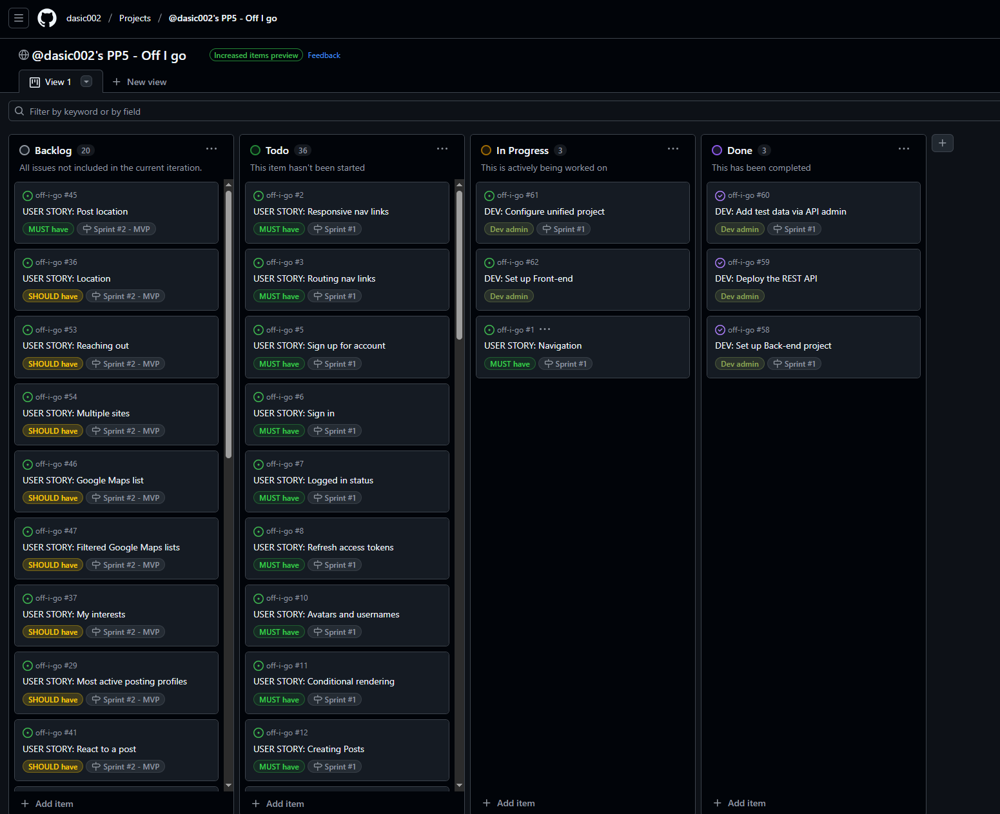
</details>

Focused on building the Must have User Stories in the first Sprint, reviewing the priority of User Stories at the end of each sprint, having to split Epics when they had been too big or when certain User stories weren't feasible to build in the given time.

### Sprint #1 - Focusing on similar features to the walkthrough project - [Due by Mar 25, 2025](https://github.com/dasic002/off-i-go/milestone/1)

Did not complete within the timeframe, so continued the build based on the user stories here. Has been completed for submission.

### Sprint #2 - Building the MVP app to satisfy Pass criteria - [Due by Apr 1, 2025](https://github.com/dasic002/off-i-go/milestone/2)

Did not start it on time, once the items from Sprint 1 were completed, began working through these.

### Sprint #3 - Further features to enrich the Experience - [Due by Apr 7, 2025](https://github.com/dasic002/off-i-go/milestone/3)

Did not get to these.

<details>
    <summary><strong>Screenshot of Milestones</strong></summary>
    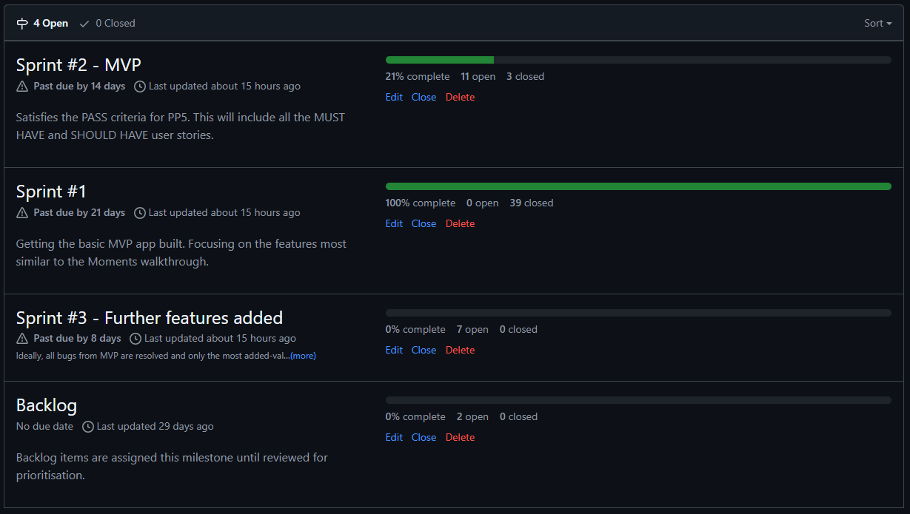
</details>

### Conclusion

Starting the project with this level of planning does help prioritise the work needed for MVP and switching between User stories and User Experience helped build a fuller picture of the intention for the website.

However, building milestones, I'm an optimistic planner and underestimate the time-effort required for certain tasks, so I struggle to estimate User Story points to effectively plan the sprints to a more realistic timeframe. In hindsight, had I given my agile planning some more time, at the time that they were due and actually reviewed the user stories and epics into new sprints, it may have given me more focus on which features to build on next.

# Additional Information

<!-- Frontend Libraries -->
<!-- Justifications for the choice of specific front-end libraries used in the project -->

## Credits

<!-- List of tutorials or articles used while developing the project -->

### Code

- Code Intitute's DRF_API walkthrough project, which this project is largely based on and customised to our needs.
- [Django Docs](https://docs.djangoproject.com/en/3.2/) frequently referred to throughout the development of this project.
- Tutorial from Code Institute's Moments walkthrough project was referred to often to remind me how we implemented a feature and why.
- [Django taggit docs](https://django-taggit.readthedocs.io/en/latest/getting_started.html) referred to for implementation steps and a YouTube video by [BugBytes](https://youtu.be/iFE6nhst2r8?si=-P1Cp_u20TwoLs10) helped me understand the structure of the taggit models.
- [Timmy O'Mahony Blog's](https://timmyomahony.com/blog/the-missing-gfk-model-manager-for-django-models/) article helped me understand what GFK was and how it could be used.
- [Generic Relations](https://docs.djangoproject.com/en/3.2/ref/contrib/contenttypes/#generic-relations) helped me build models that needed to become more generic across the models.
- [PawfectMatch project](https://github.com/Julia-Wagner/PawfectMatch-API/blob/main/medias/models.py) taught me about the simple implementation of CloudinaryVideoStorage to be able to upload videos without a lot more prep work like finding another library or implementing Cloudinary's Python SDK.
- [Video on building User Stories](https://www.youtube.com/watch?v=7hoGqhb6qAs) - a different reference to help me get the mindset of the user story building.
- Copilot AI within GitHub was used to help generate the basis of Acceptance Criteria and Tasks of our User Stories issues.
- [Image alt text styling](https://piccalil.li/blog/you-can-style-alt-text-like-any-other-text/) so that if the animated logo fails to load, the browser renders hides the image logo and renders the alternative text logo instead, which is triggered with the onerror attribute.

### Content

Advice for promoting inclusivity for disabled people and people with impairments referred to, from sites such as [Scope](https://www.scope.org.uk/advice-and-support/finding-accessible-transport), various articles at [Scope for business](https://business.scope.org.uk/), [nidirect](https://www.nidirect.gov.uk/articles/planning-trip-if-you-have-disability) and [CILNI](https://cilni.org/travel-with-ease-essential-tips-for-travelers-with-disabilities/).

- Inspiration of functions for social media platforms:
  - [Facebook](https://www.facebook.com/) and [Instagram](https://www.instagram.com/) - for adding reactions, Reposting posts, replying to comments, tagging profiles to a post, notifications and messaging.
  - [TikTok](https://www.tiktok.com/) - for the profile page content, how an owner can see their history and private content through panels.

### Media

- [Vector images of disabled characters](https://www.freevector.com/set-of-empowering-disabled-people-character-57686#) used in Sign up and Sign in Forms.
  <!-- License -->
  <!-- Information about the software license (if applicable) -->

### Acknoledgements

- My mentor Spencer Barriball for his insight, guidance and words of encouragement.